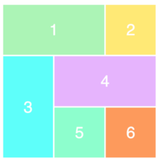

### 单个grid设置
```html
<div class="wrapper">
  <div>1</div>
  <div>2</div>
  <div>3</div>
  <div>4</div>
  <div>5</div>
  <div>6</div>
</div>
```
```css
.wrapper {
    display: grid;
}
```
得到的效果是6个简单的div堆在一起

### grid-template-row和grid-template-column
```css
.wrapper {
    display: grid;
    grid-template-columns: 100px 100px 100px;
    grid-template-rows: 50px 50px;
}
```
grid-template-columns 设置的3个值,代表3列,每列100px

grid-template-rows 设置的2个值,代表2行,每行50px


### grid-template-areas 属性
grid-template-areas属性用于定义区域
```css
.container {
  display: grid;
  grid-template-columns: 100px 100px 100px;
  grid-template-rows: 100px 100px 100px;
  grid-template-areas: 'a b c'
                       'd e f'
                       'g h i';
}
先划分出9个单元格，然后将其定名为a到i的九个区域，分别对应这九个单元格。

grid-template-areas: 'a a a'
                     'b b b'
                     'c c c';
将9个单元格分成a、b、c三个区域。

grid-template-areas: "header header header"
                     "main main sidebar"
                     "footer footer footer";
顶部是页眉区域header，底部是页脚区域footer，中间部分则为main和sidebar。

grid-template-areas: 'a . c'
                     'd . f'
                     'g . i';
如果某些区域不需要利用，则使用"点"（.）表示。

grid-template属性是grid-template-columns、grid-template-rows和grid-template-areas这三个属性的合并
```

### 设置item
```css
.item1 {
    grid-column-start: 1;
    grid-column-end: 4;
}
```
item1 占据从第一条网格线开始，到第四条网格线结束,它将独立占据整行


亦可缩写如下:
```css
.item1 {
    grid-column: 1 / 4;
}
```

复杂的样式及其效果:
```css
.item1 {
    grid-column-start: 1;
    grid-column-end: 3;
}
.item3 {
    grid-row-start: 2;
    grid-row-end: 4;
}
.item4 {
    grid-column-start: 2;
    grid-column-end: 4;
}
```



```css
.other{
    grid-template-columns: repeat(2, 100px 20px 80px);
    定义了6列，第一列和第四列的宽度为100px，第二列和第五列为20px，第三列和第六列为80px

    grid-template-columns: repeat(3, 33.33%);
    repeat()接受两个参数，第一个参数是重复的次数（上例是3），第二个参数是所要重复的值。
}
```

### grid-gap
    grid-row-gap属性设置行与行的间隔（行间距）
    grid-column-gap属性设置列与列的间隔（列间距）

    根据最新标准，上面三个属性名的grid-前缀已经删除，grid-column-gap和grid-row-gap写成column-gap和row-gap，grid-gap写成gap。

### 响应式
```html
<div class="outer">
    <div class="n1">n1</div>
    <div class="n2">n2</div>
    <div class="n3">n3</div>
    <div class="n4">n4</div>
    <div class="n5">n5</div>
</div>
<style>
    div {
        border: 1px solid lightcoral;
        text-align: center;
    }
    .outer {
        display: grid;
        grid: 100px 100px 100px / 100px repeat(4, minmax(100px, 1fr)) 100px;
        grid-template-areas: 'n1 n1 n1 n1 n1 n1' 'n2 n3 n3 n3 n3 n4' 'n5 n5 n5 n5 n5 n5';
        justify-content: stretch;

        overflow: auto;
    }
    .n1 {
        grid-area: n1;
    }
    .n2 {
        grid-area: n2;
    }
    .n3 {
        grid-area: n3;
    }
    .n4 {
        grid-area: n4;
    }
    .n5 {
        grid-area: n5;
    }
    @media screen and (max-width: 640px) {
        .outer {
            grid: 50px 100px 50px / 100px repeat(4, minmax(100px, 1fr)) 100px;
            grid-template-areas: 'n1 n1 n1 n1 n1 n1' 'n3 n3 n3 n3 n3 n3' 'n5 n5 n5 n5 n5 n5';
        }
        .n2 {
            display: none;
        }
        .n4 {
            display: none;
        }
    }
</style>
```


### 实战
    https://www.html.cn/archives/8512
    https://www.html.cn/archives/8510
    布局利器 响应式 grid-template-areas

    https://developer.mozilla.org/zh-CN/docs/Web/CSS/CSS_Grid_Layout
    详解

    http://www.ruanyifeng.com/blog/2019/03/grid-layout-tutorial.html
    CSS Grid 网格布局教程

    