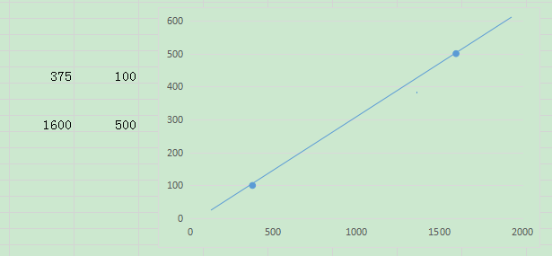
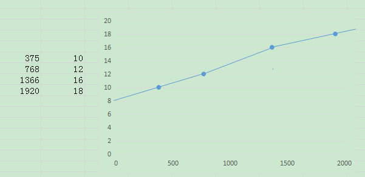

### 线性响应式
```css
width: calc(100px + ((100vw - 375px) * (500 - 100) / (1600 - 375)));
```
实现在屏幕宽度为375px时,width值为100px;在屏幕宽度为1600px时,width值为500px

效果:


提供scss函数简化代码:
```scss
@function responseValue($a,$b) {
  @return calc(#{$a} + ((100vw - 375px) * (#{$b / ($b * 0 + 1)} - #{$a / ($a * 0 + 1)}) / (1600 - 375)));
}
```
注:
* 参数只接受px单位,%单位无效,因为calc中 a/b ,b只能接受数值
* 在屏幕变得特别大的时候,在有些比例下可能导致盒子宽度超出预想,有些时候要结合min-width,max-width类似属性进行约束

### 基于vw等viewport视区单位配合rem响应式排版和布局
    https://www.zhangxinxu.com/wordpress/2016/08/vw-viewport-responsive-layout-typography/#comments
    1. 结合calc和vw控制font-size线性渐变
    2. 通过媒体查询控制其在不同的浏览器宽度区间中变化趋势不同

```scss
html {
  font-size: calc(62.5% + 4 * (100vw - 375px) / (768 - 375));// 10px -12px
}
@media screen and (min-width: 768px) {
  html {
    font-size: calc(75% + 4 * (100vw - 768px) / (1366 - 768)); // 12px-16px
  }
}
@media screen and (min-width: 1366px) { // 设计稿
  html {
    font-size: calc(100% + 2 * (100vw - 1366px) / (1600 - 1366));// 16px-18px
  }
}

@function px2rem($px) { // 设计稿psd
  @return ($px / 16px) * 1rem;
}
@mixin xsView {
  @media screen and (max-width: 768px) {
    @content;
  }
}
```


```js
+    "cssnano": "^4.1.10",
+    "postcss-aspect-ratio-mini": "^1.0.1",
+    "postcss-cssnext": "^3.1.0",
+    "postcss-import": "^12.0.1",
+    "postcss-px-to-viewport": "^1.1.1",
+    "postcss-viewport-units": "^0.1.6",
+    "postcss-write-svg": "^3.0.1",
+    "cssnano-preset-advanced": "^4.0.7",
```


### 定值阶梯型响应式
```scss
@mixin responseWidth($list) {
  @each $point, $size in $list {
    //设置一个默认的值
    @if $point == "null" {
      width: $size;
    } @else {
      @media screen and (min-width: $point) {
        width: $size;
      }
    }
  }
}

  $widthList: (
    'null' : 100px,
    '480px': 200px,
    '728px': 300px,
    '1200px': 400px,
  );
  .test {
    @include responseWidth($widthList);
    border-bottom: 10px solid lightcoral;
  }
```


### 实现响应式scss
```scss
@mixin testName($name,$valueList,$stepLength:2) {
  $resList: 375px, 1600px;

  $valueListSize: length($valueList);

  $resListFirst: nth($resList, 1); // 头部
  $resListLast: nth($resList, length($resList)); // 尾部

  // 如果 stepLength 高于 length($valueList),则重置$valueList
  @if $stepLength > $valueListSize {
    $valueListFirst: nth($valueList, 1); // 头部
    $valueListLast: nth($valueList, length($valueList)); // 尾部

    $valueList: ($valueListFirst);
    @for $i from 2 through $stepLength {
      @debug '1111111' $i;
      $valueList: append($valueList, #{$valueListFirst + ($valueListLast - $valueListFirst) / $stepLength * $i}); // 补充剩余的
    }
    $valueListSize: length($valueList);
  }
  @debug '>>>>>>>>' $valueList; // (头部值, ..中间值.., 尾部值)

  $resListChange: ($resListFirst);
  @for $i from 2 through $valueListSize {
    @debug '1111111' $i;
    $resListChange: append($resListChange, #{$resListFirst + ($resListLast - $resListFirst) / $valueListSize * $i}); // 补充剩余的
  }
  @debug '>>>>>>>>' $resListChange; // (头部值, ..中间值.., 尾部值)

  #{$name}: nth($valueList, 1);
  @each $res in $valueList {
    $index: index($valueList, $res);
    @media only screen and (min-width: nth($resListChange, $index)) {
      #{$name}: $res;
    }
  }
}

@include testName(width, (100%, 50%));
```