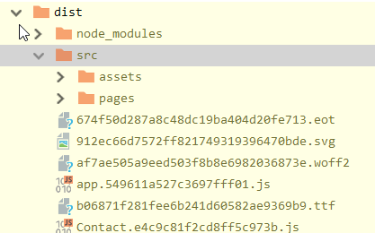
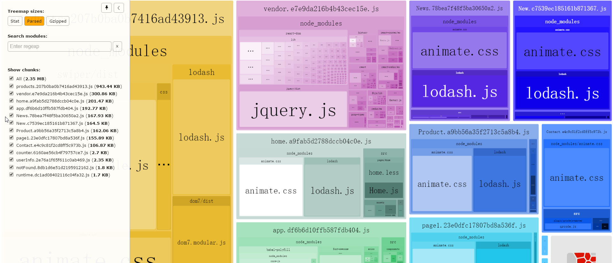

### 相关文章
[webpack之前端性能优化(史上最全，不断更新中。。。)](http://www.cnblogs.com/ssh-007/p/7944491.html)

[webpack代码分割技巧](http://foio.github.io/wepack-code-spliting/)

[webpack学习笔记—优化缓存、合并、懒加载等](https://www.cnblogs.com/yangmin01/p/6290595.html)

[通过DllPlugin DllReferencePlugin 实现依赖包分开打包并注入到代码中](https://www.jianshu.com/p/862c56479456)

[Webpack 性能优化 (一)(使用别名做重定向)](http://www.ituring.com.cn/article/200534)

### webpack核心概念
Manifest  模板热替换  代码分离(code splitting) 模板(Modules)

  3.代码分离(code splitting)

  代码分离是将代码分离到不同的bundle中，能够按需加载或者并行加载这些文件。代码分离可以获取更小的bundle,以及控制资源加载优先级，可影响加载时间 
  三种代码分离方法： 
  (1)入口起点：使用entry选项自动分离代码； 
  (2)防止重复：使用commonChunkPlugin去重和分离chunk 
  (3)动态导入：通过模块的内联函数调用来分离代码。


    webpack配置时的一些概念
    Entry
    入口文件是webpack建立依赖图的起点。

    Output
    Output配置告诉webpack怎么处理打包的代码。

    Hot Module Replacement
    热模块替换功能可以在不刷新所有文件的情况下实现单独跟新某个模块。

    Tree Shaking
    去除无用代码，比如某个js文件里的函数并没有被使用，这段函数代码在打包时将会被去掉。

    Code Splitting
    代码拆分，实现的方式有三种

    Entry Points 手动把代码分成多个入口
    Prevent Duplication 使用插件CommonsChunkPlugin提取公共代码块
    Dynamic Imports 用import函数动态动引入模块
    Lazy Loading
    懒加载或者按需加载，属于Code Splitting的一部分

    Loaders
    webpack把所有文件都当成模块对待，但是它只理解Javascript。Loaders把这些webpack不认识的文件转化成模块，以便webpack进行处理。

    plugins
    插件一般用来处理打包模块的编译或代码块相关的工作。

    The Manifest
    webpack manifest文件用来引导所有模块的交互。manifest文件包含了加载和处理模块的逻辑。
    当webpack编译器处理和映射应用代码时，它把模块的详细的信息都记录到了manifest文件中。当模块被打包并运输到浏览器上时，runtime就会根据manifest文件来处理和加载模块。利用manifest就知道从哪里去获取模块代码。

### url loader的一个使用技巧
为url-loader添加name配置可以使打包后的文件保持原有的格式：



```js
{
  test: /\.(png|jpg|gif)$/,
  use: [{
    loader: 'url-loader',
    options: {
      limit: 8192,
      name: '[path][name].[ext]',// [hash].[ext]
    },
  }],
},
```

url-loader中单独配置cdn：
```js
{
  test:/\.(png|jpe?g|gif)(\?.*)/,
  use: [{
    loader: 'url-loader',
    options: {
      limit: 8192,
      name: utils.assetsPath('img/[name].[hash:7].[ext]'),
      publicPath: 'http://baidu.com/',
    },
  }],
}
```

url-loader不能检测到js中的background，所以我们凡是在js中引用的地址，必须在外面先import这张图片，url-loader才会解析并打包

### 自定义一个全局变量 window层级
webpack配置：
```javascript
  // 添加别名设置
  merge(webpackConfig, {
    resolve: {
      alias: {
        src: path.resolve(__dirname, './src'),
        color: path.resolve(__dirname, './src/color'),
      },
    },
  })

  webpackConfig.plugins.push(new webpack.ProvidePlugin({
    color: 'color',
  })

  new webpack.ProvidePlugin({
    color: 'color',
  })
```

color.js代码：
```javascript
module.exports = {
  red: '#090909'
}
```

使用：
```js
let corlorRed = color['red']
```

### webpack打包体积优化，详细分布查看插件 webpack-bundle-analyzer
安装：

```
npm install --save-dev webpack-bundle-analyzer
```

配置：在 项目的 package.json 文件中注入如下命令，以方便运行她(npm run analyz)，默认会打开http://127.0.0.1:8888作为展示。
```
    "analyz": "NODE_ENV=production npm_config_report=true npm run build",
```

使用：
```js
const BundleAnalyzerPlugin = require('webpack-bundle-analyzer').BundleAnalyzerPlugin;


  plugins: [
    new BundleAnalyzerPlugin({
      //  可以是`server`，`static`或`disabled`。
      //  在`server`模式下，分析器将启动HTTP服务器来显示软件包报告。
      //  在“静态”模式下，会生成带有报告的单个HTML文件。
      //  在`disabled`模式下，你可以使用这个插件来将`generateStatsFile`设置为`true`来生成Webpack Stats JSON文件。
      analyzerMode: 'server',
      //  将在“服务器”模式下使用的主机启动HTTP服务器。
      analyzerHost: '127.0.0.1',
      //  将在“服务器”模式下使用的端口启动HTTP服务器。
      analyzerPort: 8888, 
      //  路径捆绑，将在`static`模式下生成的报告文件。
      //  相对于捆绑输出目录。
      reportFilename: 'report.html',
      //  模块大小默认显示在报告中。
      //  应该是`stat`，`parsed`或者`gzip`中的一个。
      //  有关更多信息，请参见“定义”一节。
      defaultSizes: 'parsed',
      //  在默认浏览器中自动打开报告
      openAnalyzer: true,
      //  如果为true，则Webpack Stats JSON文件将在bundle输出目录中生成
      generateStatsFile: false, 
      //  如果`generateStatsFile`为`true`，将会生成Webpack Stats JSON文件的名字。
      //  相对于捆绑输出目录。
      statsFilename: 'stats.json',
      //  stats.toJson()方法的选项。
      //  例如，您可以使用`source：false`选项排除统计文件中模块的来源。
      //  在这里查看更多选项：https：  //github.com/webpack/webpack/blob/webpack-1/lib/Stats.js#L21
      statsOptions: null,
      logLevel: 'info' //日志级别。可以是'信息'，'警告'，'错误'或'沉默'。
    }),
  ],

```

效果：




### [webpack3] CommonsChunkPlugin正确打开方式 
#### 参考
[用 webpack 实现持久化缓存](https://sebastianblade.com/using-webpack-to-achieve-long-term-cache/#hash)

[基于webpack4[.3+]构建可预测的持久化缓存方案](https://segmentfault.com/a/1190000016355127)

[CommonsChunkPlugin](https://webpack.docschina.org/plugins/commons-chunk-plugin/)

[详解CommonsChunkPlugin的配置和用法](https://segmentfault.com/a/1190000012828879)

[CommonsChunkPlugin正确打开方式](https://cnodejs.org/topic/58396960c71e606e36aed1db)

[webpack代码分割技巧](http://foio.github.io/wepack-code-spliting/)

#### 基础配置
```json
{
  name: string, // or
  names: string[],
  // 这是 common chunk 的名称。已经存在的 chunk 可以通过传入一个已存在的 chunk 名称而被选择。
  // 如果一个字符串数组被传入，这相当于插件针对每个 chunk 名被多次调用
  // 如果该选项被忽略，同时 `options.async` 或者 `options.children` 被设置，所有的 chunk 都会被使用，
  // 否则 `options.filename` 会用于作为 chunk 名。
  // When using `options.async` to create common chunks from other async chunks you must specify an entry-point
  // chunk name here instead of omitting the `option.name`.

  filename: string,
  // common chunk 的文件名模板。可以包含与 `output.filename` 相同的占位符。
  // 如果被忽略，原本的文件名不会被修改(通常是 `output.filename` 或者 `output.chunkFilename`)。
  // This option is not permitted if you're using `options.async` as well, see below for more details.

  minChunks: number|Infinity|function(module, count) => boolean,
  // 在传入  公共chunk(commons chunk) 之前所需要包含的最少数量的 chunks 。
  // 数量必须大于等于2，或者少于等于 chunks的数量
  // 传入 `Infinity` 会马上生成 公共chunk，但里面没有模块。
  // 你可以传入一个 `function` ，以添加定制的逻辑（默认是 chunk 的数量）

  chunks: string[],
  // 通过 chunk name 去选择 chunks 的来源。chunk 必须是  公共chunk 的子模块。
  // 如果被忽略，所有的，所有的 入口chunk (entry chunk) 都会被选择。c

  children: boolean,
  // 如果设置为 `true`，所有公共 chunk 的子模块都会被选择

  deepChildren: boolean,
  // 如果设置为 `true`，所有公共 chunk 的后代模块都会被选择

  async: boolean|string,
  // 如果设置为 `true`，一个异步的  公共chunk 会作为 `options.name` 的子模块，和 `options.chunks` 的兄弟模块被创建。
  // 它会与 `options.chunks` 并行被加载。
  // Instead of using `option.filename`, it is possible to change the name of the output file by providing
  // the desired string here instead of `true`.

  minSize: number,
  // 在 公共chunk 被创建立之前，所有 公共模块 (common module) 的最少大小。
}
```

#### 公共chunk 用于 入口chunk (entry chunk)
生成一个额外的 chunk 包含入口chunk 的公共模块。
```js
new webpack.optimize.CommonsChunkPlugin('common.js'), // 默认会把所有入口节点的公共代码提取出来,生成一个common.js
```
```js
new webpack.optimize.CommonsChunkPlugin({
  name: 'commons', // (公共 chunk(commnon chunk) 的名称)
  filename: 'commons.js', // (公共chunk 的文件名)  filename: '[name].[chunkhash].js' => commons.xxx.js
  // minChunks: 3, // (模块必须被3个 入口chunk 共享)
  // chunks: ["pageA", "pageB"], // (只使用这些 入口chunk)
});
```

你必须在 入口chunk 之前加载生成的这个 公共chunk:
```html
<script src="vendor.js" charset="utf-8"></script>
<script src="app.js" charset="utf-8"></script>
```

#### 单独分离出第三方库、webpack运行文件  
* 有选择的提取公共代码, 将代码拆分成公共代码和应用代码
```js
{
  entry: {
    app: './entry',
    vendor: ['jquery', 'other-lib'],
  },
  plugins: [
    new webpack.optimize.CommonsChunkPlugin({ name: 'vendor', })
  ]
}
```
* 再次打包后的vendor文件hash值改变了，为了解决这个问题,加入runtime:
```js
module.exports = {
	entry: {
		app: './app.js',
		vendor: ['react', 'react-dom', 'moment' /*等等其他的模块*/]
	},
	//其他配置
	plugins: [
		new webpack.optimize.CommonsChunkPlugin({ names: ['vendor', 'runtime'] }) 
	]
}
```
或者:
```js
new webpack.optimize.CommonsChunkPlugin({
    name: ['vendor','runtime'],
    filename: '[name].js'
}),
//  等价于
new webpack.optimize.CommonsChunkPlugin({
    name: 'vendor',
    filename: '[name].js'
}),
new webpack.optimize.CommonsChunkPlugin({
    name: 'runtime',
    filename: '[name].js',
    chunks: ['vendor']
}),
```
打包后，会多出个runtime文件，但我们需要的vendor的hash值没有改变。 里面包含了 jsonp 方法的定义和其它 JS 的路径 mapping，因为你改了 app 会导致 runtime 里的路径改变，如果放在 vendor 中，会导致 vendor 无法长缓存。所以多出一个文件。

##### runtime
webpack中runtime和manifest主要用于管理所有模块的交互，主要是用于连接模块化应用程序的所有代码。

管理模块交互的流程： 
* 当编译器(compiler)开始执行、解析和映射应用程序时，它会保留所有模块的详细要点。这个数据集合称为 “Manifest”，当完成打包并发送到浏览器时，会在运行时通过 Manifest 来解析和加载模块。
* 无论你选择哪种模块语法，那些 import 或 require 语句现在都已经转换为 webpack_require 方法，此方法指向模块标识符(module identifier)。
* 通过使用 manifest 中的数据，runtime 将能够查询模块标识符，检索出背后对应的模块。

runtime包含：
* 功能:在模块交互时，连接模块所需的加载和解析逻辑，包括浏览器中已加载模块的连接以及懒加载模块的执行连接。
* 文件:webpackJsonp  __webpack_require__  异步 chunk 加载函数  对 ES6 Modules 的默认导出（export default）做处理 

#### 单独分离出第三方库、自定义公共模块、webpack运行文件
1. 第一种方法minChunks设为Infinity，修改webpack配置文件如下：
```js
{
  entry: {
      first: './src/first.js',
      second: './src/second.js',
      vendor: Object.keys(packagejson.dependencies)// 获取生产环境依赖的库
  },
  output: {
      path: path.resolve(__dirname,'./dist'),
      filename: '[name].js'
  },
  plugins:[
      new webpack.optimize.CommonsChunkPlugin({
          name: ['vendor','runtime'],
          filename: '[name].js',
          minChunks: Infinity // Infinity：只有当入口文件（entry chunks） >= 3 才生效，用来在第三方库中分离自定义的公共模块
      }),
      new webpack.optimize.CommonsChunkPlugin({
          name: 'common',
          filename: '[name].js',
          chunks: ['first','second']// 从first.js和second.js中抽取commons chunk
      }),
  ]
}
```

2. 第二种方法把它们分离开来，就是利用minChunks作为函数的时候，说一下minChunks作为函数两个参数的含义：
* module：当前chunk及其包含的模块
* count：当前chunk及其包含的模块被引用的次数
```js
{
  entry: {
      first: './src/first.js',
      second: './src/second.js',
      //vendor: Object.keys(packagejson.dependencies)//获取生产环境依赖的库
  },
  output: {
      path: path.resolve(__dirname,'./dist'),
      filename: '[name].js'
  },
  plugins: [
    new webpack.optimize.CommonsChunkPlugin({
        name: 'vendor',
        filename: '[name].js',
        minChunks: function (module,count) {
            console.log(module.resource,`引用次数${count}`);
            //"有正在处理文件" + "这个文件是 .js 后缀" + "这个文件是在 node_modules 中"
            return (
                module.resource &&
                /\.js$/.test(module.resource) &&
                module.resource.indexOf(path.join(__dirname, './node_modules')) === 0
            )
        }
    }),
    new webpack.optimize.CommonsChunkPlugin({
        name: 'runtime',
        filename: '[name].js',
        chunks: ['vendor']
    }),
  ]
}
```

#### 将公共模块打包进父 chunk 
使用代码拆分功能，一个 chunk 的多个子 chunk 会有公共的依赖。为了防止重复，可以将这些公共模块移入父 chunk。这会减少总体的大小，但会对首次加载时间产生不良影响。如果预期到用户需要下载许多兄弟 chunks（例如，入口 trunk 的子 chunk），那这对改善加载时间将非常有用。
```js
new webpack.optimize.CommonsChunkPlugin({
  // names: ["app", "subPageA"] // (选择 chunks，或者忽略该项设置以选择全部 chunks)
  children: true, // (选择所有被选 chunks 的子 chunks)
  // minChunks: 3, // (在提取之前需要至少三个子 chunk 共享这个模块)
});
```


### 缓存 moduleid chunckid
[用 webpack 实现持久化缓存](https://sebastianblade.com/using-webpack-to-achieve-long-term-cache/#webpack)

[基于 webpack 的持久化缓存方案](https://github.com/pigcan/blog/issues/9)
* 对脚本文件应用 [chunkhash] 对 extractTextPlugin 应用的的文件应用 [contenthash]；
* 使用 CommonsChunkPlugin 合理抽出公共库 vendor（包含社区工具库这些 如 lodash）, 如果必要也可以抽取业务公共库 common(公共部分的业务逻辑)，以及 webpack的 runtime；
* 在开发环境下使用 NamedModulesPlugin 来固化 module id，在生产环境下使用 HashedModuleIdsPlugin 来固化 module id
* 使用 NamedChunksPlugin 来固化 runtime 内以及在使用动态加载时分离出的 chunk 的 chunk id。

[详解多页应用 Webpack4 配置优化与踩坑记录](https://www.jb51.net/article/148946.htm)
#### 如何生成稳定ModuleId

稍微了解过 webpack 运行机制的同学会知道，项目工程中加载的 module，webpack 会为其分配一个 moduleId，映射对应的模块。且该标识会出现在构建之后的代码中

模块的 ID 是 webpack 根据依赖的收集顺序递增的正整数，这种 ID 分配方式不太稳定，因为修改一个被依赖较多的模块，依赖这个模块的 chunks 内容均会跟着模块的新 ID 一起改变，但实际上我们只想让用户下载有真正改动的 chunk，而不是所有依赖这个新模块的 chunk 都重新更新。

一旦工程中模块有增删或者顺序变化，moduleId 就会发生变化，进而可能影响所有 chunk 的 content hash 值。只是因为 moduleId 变化就导致缓存失效，这肯定不是我们想要的结果。

在 webpack4 以前，通过[NamedModulesPlugin|HashedModuleIdsPlugin]插件，我们可以将模块的路径映射成 hash 值，来替代 moduleId，因为模块路径是基本不变的，故而 hash 值也基本不变。

    NamedModulesPlugin 
        这个模块可以将依赖模块的正整数 ID 替换为相对路径（如：将 4 替换为 ./node_modules/es6-promise/dist/es6-promise.js）。
    HashedModuleIdsPlugin 
        这是 NamedModulesPlugin 的进阶模块，它在其基础上对模块路径进行 MD5 摘要，不仅可以实现持久化缓存，同时还避免了它引起的两个问题（文件增大，路径泄露）。用 HashedModuleIdsPlugin 可以轻松地实现 chunkhash 的稳定化！

    NamedModulesPlugin 适合在开发环境，而在生产环境下请使用 HashedModuleIdsPlugin。

**但在 webpack4 中，只需要optimization的配置项中设置 moduleIds 为 hashed 即可。**

样例问题:
* 只修改了 home/index.js 的代码，但在最终的构建结果中，vendor.js 的文件指纹也被修改了

原因有两个:
* webpack runtime (运行时) 中包含 chunks ID 及其对应 chunkhash 的对象，但 runtime 被集成到 vendor.js 中。
* entry 内容修改后，由于 webpack 的依赖收集规则导致构建产生的 entry chunk 对应的 ID 发生变化，webpack runtime 也因此被改变。

解决办法:
* 使用 CommonsChunkPlugin 继续将webpack runtime抽离出来
* 使用HashedModuleIdsPlugin代替原有的ModuleId根据依赖的收集顺序递增的正整数生成规则。

#### 如何生成稳定的ChunkId 
除了 moduleId，我们知道分离出的 chunk 也有其 chunkId。同样的，chunkId 也有因其 chunkId 发生变化而导致缓存失效的问题。由于manifest与打出的 chunk 包中有chunkId相关数据，所以一旦如“增删页面”这样的操作导致 chunkId 发生变化，可能会影响很多的 chunk 缓存失效。

Webpack是根据模块的顺序递增chunkid，源代码中的applyChunkIds函数,所以官方有提供NamedChunksPlugin插件来根据文件名来稳定你的chunkid

webpackJsonp有三个参数，每次有新的entry加入说明资源数增加了，Chunk数量也会跟着增加。ChunkId也会递增

在生产环境中的Webpack配置添加plugin: NamedChunksPlugin
```js
// 使用模块名称作为chunkid,替换掉原本的使用递增id来作为chunkid导致的[新增entry模块,其他模块的hash发生抖动,导致客户端长效缓存失效 !!!
new webpack.NamedChunksPlugin((chunk) => {
  // 解决异步模块打包的问题
  if (chunk.name) {
    return chunk.name;
  }
  return chunk.modules.map(m => path.relative(m.context, m.request)).join("_");
})
```

在 webpack4 以前，通过增加NamedChunksPlugin，使用 chunkName 来替换 chunkId，实现固化 chunkId，保持缓存的能力。在 webpack4 中，只需在optimization的配置项中设置 namedChunks 为 true 即可。

### [webpack4] optimization.splitChunks optimization.runtimeChunk
https://www.jb51.net/article/148946.htm

### 使用DllPlugin和DllReferencePlugin分割代码
将常用的库文件打包到dll包中，然后在webpack配置中引用。业务代码的可以像往常一样使用require引入依赖模块，比如require('react'), webpack打包业务代码时会首先查找该模块是否已经包含在dll中了，只有dll中没有该模块时，webpack才将其打包到业务chunk中。

首先我们使用DllPlugin将常用的库打包在一起：
```js
var webpack = require('webpack');
module.exports = {
  entry: {
    vendor: ['lodash','react'],
  },
  output: {
    filename: '[name].[chunkhash].js',
    path: 'build/',
  },
  plugins: [new webpack.DllPlugin({
    name: '[name]_lib',
    path: './[name]-manifest.json',
  })]
};
```

该配置会产生两个文件，模块库文件：vender.[chunkhash].js和模块映射文件：vender-menifest.json。其中vender-menifest.json标明了模块路径和模块ID（由webpack产生）的映射关系

在业务代码的webpack配置文件中使用DllReferencePlugin插件引用模块映射文件：vender-menifest.json后，我们可以正常的通过require引入依赖的模块，如果在vender-menifest.json中找到依赖模块的路径映射信息，webpack会直接使用dll包中的该依赖模块，否则将该依赖模块打包到业务chunk中。

```js
var webpack = require('webpack');
module.exports = {
  entry: {
    app: ['./app'],
  },
  output: {
    filename: '[name].[chunkhash].js',
    path: 'build/',
  },
  plugins: [
    new webpack.DllReferencePlugin({ context: '.', manifest: require('./vendor-manifest.json'), })
  ]
};
```

由于依赖的模块都在dll包中，所以例子中app打包后的chunk很小。

相比于CommonChunkPlugin，使用DllReferencePlugin分割代码有两个明显的好处：
* 由于dll包和业务chunk包是分开进行打包的，每一次修改代码时只需要对业务chunk重新打包，webpack的编译速度得到极大的提升，因此相比于CommonChunkPlugin，DllPlugin进行代码分割可以显著的提升开发效率。
* 使用DllPlugin进行代码分割，dll包和业务chunk相互独立，其chunkhash互不影响，dll包很少变动，因此可以更充分的利用浏览器的缓存系统。而使用CommonChunk打包出的代码，由于公有chunk中包含了webpack的runtime(运行时)，公有chunk和业务chunk的chunkhash会互相影响，必须将runtime单独提取出来，才能对公有chunk充分地使用浏览器的缓存。

### resolve.alias 与 module.noParse 的组合
#### 在 Webpack 中使用别名
别名(resolve.alias) 是 Webpack 的一个配置项，它的作用是把用户的一个请求重定向到另一个路径，例如通过修改 webpack.config.js配置文件，加入：

```js
  resolve: {
    alias: {
        moment: "moment/min/moment-with-locales.min.js"
    }
  }
```

这样待打包的脚本中的 require('moment'); 其实就等价于 require('moment/min/moment-with-locales.min.js'); 。通过别名的使用在本例中可以减少几乎一半的时间。

#### 在 Webpack中忽略对已知文件的解析
module.noParse 是 webpack 的另一个很有用的配置项，如果你 确定一个模块中没有其它新的依赖 就可以配置这项，webpack 将不再扫描这个文件中的依赖。

```js
  module: {
    noParse: [/moment-with-locales/]
  }
```

这样修改，再结合前面重命名的例子，更新后的流程是：
* webpack 检查到 entry.js 文件对 moment的请求；
* 请求被 alias 重定向，转而请求 moment/min/moment-with-locales.min.js；
* noParse 规则中的 /moment-with-locales/一条生效，所以 webpack 就直接把依赖打包进了 bundle.js 。

#### 组合写法

```js
  module: {
    noParse: [path.resolve(node_modules, 'swiper/dist/js/swiper.min.js')],
  },

  resolve: {
    alias: {
      swiper$: path.resolve(node_modules, 'swiper/dist/js/swiper.min.js'),// 开启精准模式(import swiperStyle from 'swiper/dist/css/swiper.min.css')不匹配
    },
  },
```

```js
var webpack = require("webpack");
var path = require('path');
var node_modules = path.resolve(__dirname, 'node_modules');
var pathToReact = path.resolve(node_modules, 'react/dist/react.min.js');
var pathToReactDOM = path.resolve(node_modules, 'react-dom/dist/react-dom.min.js');
...
var HtmlWebpackPlugin = require('html-webpack-plugin');

var deps = [
    'react/dist/react.min.js',
    'react-dom/dist/react-dom.min.js'
];
var config = {
    ...
    resolve:{
        alias:{},
        fallback:path.join(__dirname, "node_modules")
    },
    ...
    module:{
         ...
         noParse:[]   
     }    
}
/*当加载多个压缩文件时，下述方法更优雅简便*/
deps.forEach(function(dep){    
    var depPath = path.resolve(node_modules, dep);
    //path.dep是路径分隔符。
    config.resolve.alias[dep.split(path.dep)[0]] = depPath;    
    config.module.noParse.push(depPath);

});

module.exports = config;
```

### 异步加载 import() 使用方式
```js
    import(/* webpackChunkName: "swiper" */ 'swiper/dist/css/swiper.min.css')
    import(/* webpackChunkName: "swiper" */ 'swiper').then(Swiper => {
      var swiper = new Swiper('.swiper-container', {
        slidesPerView: 3,
        spaceBetween: 30,
        freeMode: true,
        pagination: {
          el: '.swiper-pagination',
          clickable: true,
        },
      });
    })
```


### 其他一些插件
    NpmInstallWebpackPlugin 
        automatically to install & save missing dependencies while you work!

    BabelMinifyWebpackPlugin
        一个用于babel-minify的 webpack 插件 - 基于 babel 的 minifier


    ProvidePlugin
        自动加载模块，而不必到处 import 或 require 。
        new webpack.ProvidePlugin({
          $: 'jquery',
          jQuery: 'jquery'
        });

    在生产版本的配置中添加这些插件：

    DefinePlugin
        new webpack.DefinePlugin({
          'process.env': {
            NODE_ENV: JSON.stringify('production')
          }
        }),

    UglifyJsPlugin
        new webpack.optimize.UglifyJsPlugin()

### 哈希值的不同
* hash 是 build-specific ，即每次编译都不同——适用于开发阶段
* chunkhash 是 chunk-specific，是根据每个 chunk 的内容计算出的 hash——适用于生产
* contenthash:extract-text-plugin 为抽离出来的内容提供了 contenthash 即： new ExtractTextPlugin('[name]-[contenthash].css')

建议
* 在生产环境，要把文件名改成'[name].[chunkhash]'，最大限度的利用浏览器缓存。
* 不要在开发环境使用 [chunkhash]/[hash]/[contenthash]，因为不需要在开发环境做持久缓存，而且这样会增加编译时间，开发环境用 [name] 就可以了。


