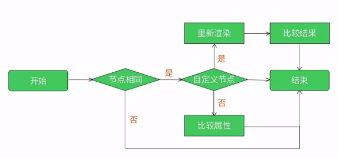
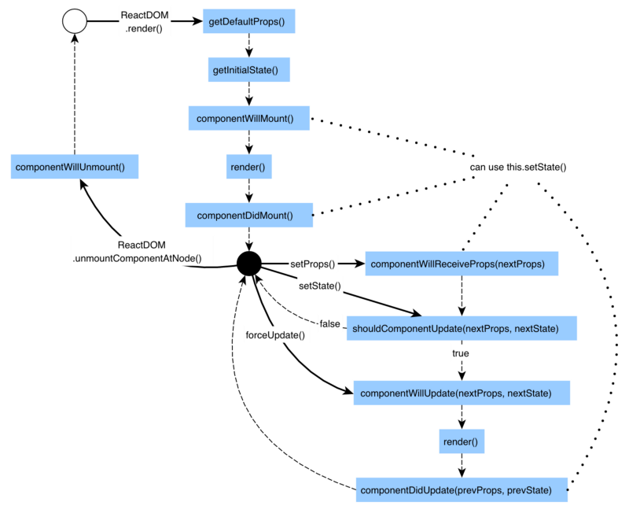

### react diff算法流程图

### 组件的生命周期	
    组件的生命周期分成三个状态：
        Mounting：已插入真实 DOM
        Updating：正在被重新渲染
        Unmounting：已移出真实 DOM

    React 为每个状态都提供了两种处理函数，will 函数在进入状态之前调用，did 函数在进入状态之后调用，三种状态共计五种处理函数。
        componentWillMount()
        componentDidMount()
        componentWillUpdate(object nextProps, object nextState)
        componentDidUpdate(object prevProps, object prevState)
        componentWillUnmount()

    此外，React 还提供两种特殊状态的处理函数。
        componentWillReceiveProps(object nextProps)：已加载组件收到新的参数时调用
        shouldComponentUpdate(object nextProps, object nextState)：组件判断是否重新渲染时调用

### 过程
[React组件生命周期过程说明](http://react-china.org/t/react/1740)

[React组件生命周期](https://segmentfault.com/a/1190000006792687)

    React组件提供了生命周期的钩子函数去响应组件不同时刻的状态，组件的生命周期如下：
    1. 实例化
        首次实例化 getDefaultProps getInitialState componentWillMount render componentDidMount
        实例化完成后的更新 getInitialState componentWillMount render componentDidMount
    2. 存在期
        组件已存在时的状态改变 componentWillReceiveProps shouldComponentUpdate componentWillUpdate render componentDidUpdate
    3. 销毁&清理期
        componentWillUnmount

#### 生命周期共提供了10个不同的API。
    1.getDefaultProps
    作用于组件类，只调用一次，返回对象用于设置默认的props，对于引用值，会在实例中共享。
    class Component {
        static defaultProps = {}
    }

    2.getInitialState
    作用于组件的实例，在实例创建时调用一次，用于初始化每个实例的state，此时可以访问this.props。
    class Component extends React.Component{
        constructor(){
            this.state = {
                render: true,
            }
        }
    }
    3.componentWillMount
    在完成首次渲染之前调用，此时仍可以修改组件的state。这个是在render方法调用前可修改state的最后一次机会。这个方法很少用到。

    4.render
    必选的方法，创建虚拟DOM，该方法具有特殊的规则：
        只能通过this.props和this.state访问数据
        可以返回null、false或任何React组件
        只能出现一个顶级组件（不能返回数组）
        不能改变组件的状态
        不能修改DOM的输出
    JSX通过这里，解析成对应的虚拟DOM，渲染成最终效果。格式大致如下：
    class Component extends React.Component{
        render(){
            return (
                

            )
        }
    }
    5.componentDidMount
    真实的DOM被渲染出来后调用，在该方法中可通过this.getDOMNode()访问到真实的DOM元素。此时已可以使用其他类库来操作这个DOM。
    在服务端中，该方法不会被调用。
    当我们需要请求外部接口数据，一般都在这里处理。

    6.componentWillReceiveProps
    组件接收到新的props时调用，并将其作为参数nextProps使用，此时可以更改组件props及state。
    componentWillReceiveProps: function(nextProps) {
        if (nextProps.bool) {
            this.setState({
                bool: true
            });
        }
    }

    7.shouldComponentUpdate
    组件是否应当渲染新的props或state，返回false表示跳过后续的生命周期方法，通常不需要使用以避免出现bug。在出现应用的瓶颈时，可通过该方法进行适当的优化。
    在首次渲染期间或者调用了forceUpdate方法后，该方法不会被调用

    8.componentWillUpdate
    接收到新的props或者state后，进行渲染之前调用，此时不允许更新props或state。

    9.componentDidUpdate
    完成渲染新的props或者state后调用，此时可以访问到新的DOM元素。

    10.componentWillUnmount
    组件被移除之前被调用，可以用于做一些清理工作，在componentDidMount方法中添加的所有任务都需要在该方法中撤销，比如创建的定时器或添加的事件监听器。

### 优化处理
    大话immutable.js
    https://www.cnblogs.com/yoissee/p/6001465.html
    
    使用 React 和 ImmutableJS 构建一个拖放布局构建器
    https://juejin.im/post/5cccfa56f265da034c7038f3

    https://github.com/brianneisler/mudash
    结合immutable与lodash

    http://blog.codingplayboy.com/2017/09/14/immutable-react-redux/
    Immutable.js与React,Redux及reselect的实践

* React 中的状态保存在不可变的数据结构中,是使 React 组件如何渲染的唯一真实的数据来源
* 这意味着一旦创建了数据对象，就不能直接去修改它。除非我们创建一个具有更改状态的新对象。
* 为了支持不变性，React 为我们提供了一个方法 this.setState()，我们可以使用它来告诉组件状态已经改变，并且组件还需要重新进行渲染如果状态发生任何改变。

react性能优化
    1. shouldComponentUpdate [Pure render decorator(第一层子属性'==='判断)]
    2. Immutable

Immutable Data 就是一旦创建，就不能再被更改的数据。对 Immutable 对象的任何修改或添加删除操作都会返回一个新的 Immutable 对象。

Immutable 实现的原理是 Persistent Data Structure（持久化数据结构），也就是使用旧数据创建新数据时，要保证旧数据同时可用且不变。同时为了避免 deepCopy 把所有节点都复制一遍带来的性能损耗，Immutable 使用了 Structural Sharing（结构共享），即如果对象树中一个节点发生变化，只修改这个节点和受它影响的父节点，其它节点则进行共享。

