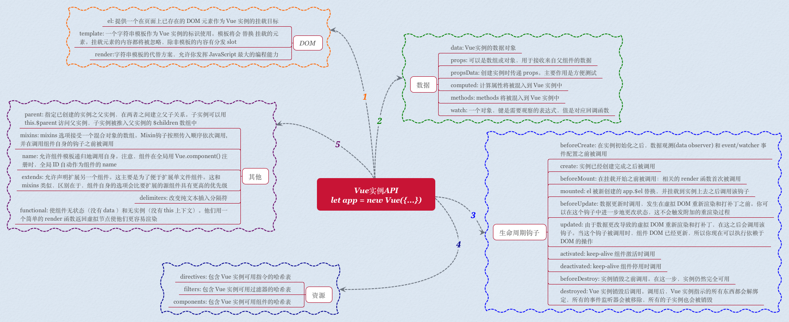
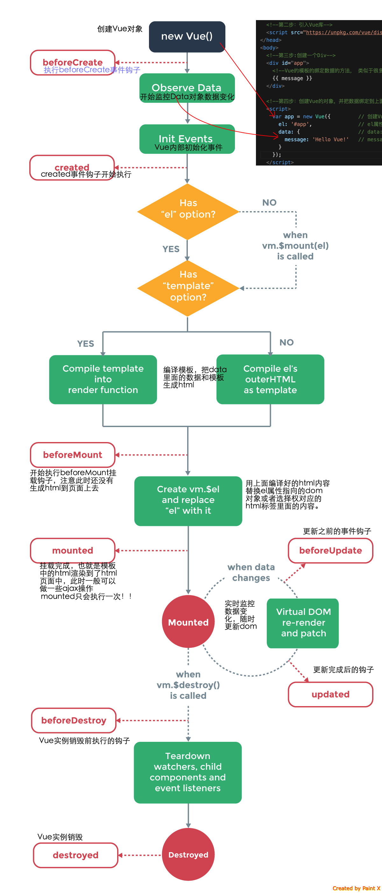
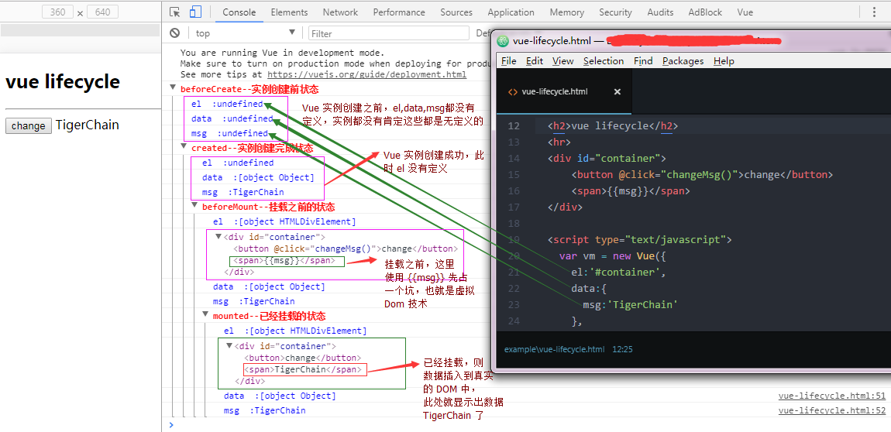

## 构造函数参数 实例属性+方法
### Vue()函数
    每个Vue的应用都是通过Vue()函数创建一个新的Vue实例开始的。创建了一个Vue实例，其实就创建了一个ViewModel。
    在vue的实例中，可以插入挂载元素 数据选项，还可以插入模板 方法 生命周期钩子...
    new Vue({})

### 函数参数
	Vue.js的组件可以理解为预先定义好了行为的ViewModel类。一个组件可以预定义很多选项(参数)，但最核心的是以下几个

    数据相关 data props propsData computed  filter
    生命周期函数 beforeCreate created beforeMount mounted beforeUpdate updated beforeDestroy destroyed
    DOM相关 el render template
    其他 directives components provide

### vue实例属性
    vm.$data      Vue实例观察的数据对象，vue实例代理了对其data对象的访问
    vm.$el        vue实例使用的根DOM元素
    vm.$option    用于当前vue实例的初始化选项 $options属性，它包含了数据、计算属性和方法等等
    vm.$parent    父实例
    vm.$children  
    vm.$root
    vm.$slots     用来访问被slot分发的内容，每个具名slot有其相应的属性[slot="foo"中的内容将会在app.$slots.foo中被找到]
    vm.$scopedSlots
    vm.$refs      包含了所有拥有ref注册的子组件
    vm.$isServe   当前vue实例是否运行于服务器

### vue实例方法
    事件 .$on .$off .$once .$emit
    数据 .$watch .$set .$delete [Vue.set Vue.delete]
    生命周期 
        vm.$mount      如果vue实例没有收到el设置，则处于未挂载状态，没有关联的DOM元素；可以使用app.$mount("#app")手动挂载一个未挂载的实例
        vm.$forceUpdate 使vue实例重新渲染，仅仅影响实例本身和插入插槽内容的额子组件
        vm.$nextTick   将回调延迟到下次DOM更新循环之后执行。在修改数据之后使用
        vm.$destroy    完全销毁一个vue实例（清理与其他实例的连接 解绑其它全部指令和事件监听器）

###  Vue构造函数静态方法
    十个全局API：
        Vue.extend：使用基础Vue构造器，创建一个“子类”。参数是一个包含组件选项的对象
        Vue.nextTick：在下次DOM更新循环结束之后执行延迟回调。在修改数据之后立即使用这个方法，获取更新后的DOM
        Vue.set：设置对象的属性。如果对象是响应式的，确保属性被创建后也是响应式的，同时触发视图更新。这个方法主要用于避开Vue不能检测属性被添加的限制
        Vue.delete：删除对象的属性。如果对象是响应式的，确保删除能触发更新视图。这个方法主要用于避开Vue不能检测到属性被删除的限制，但是你应该很少会使用它
        Vue.directive：注册或获取全局指令
        Vue.filter：注册或获取全局过滤器
        Vue.component：注册或获取全局组件。注册还会自动使用给定的id设置组件的名称
        Vue.use：安装Vue.js插件
        Vue.mixin：全局注册一个混合，影响注册之后所有创建的每个Vue实例
        Vue.compile：在render函数中编译模板字符串。只在独立构建时有效
        
###  全局配置Vue.config
    六个全局Vue.config的API是：
        Vue.config.silent = true： 取消Vue所有的日志与警告
        Vue.config.optionMergeStrategies.methods：自定义合并策略的选项
        Vue.config.devtools = true：配置是否允许vue-devtools检查代码
        Vue.config.errorHandler = function(err, vm){}：指定组件的渲染和观察期间未捕获错误的处理函数
        Vue.config.ignoredElements = ['my-custom-web-component','another-web-component']：忽略在Vue之外的自定义元素
        Vue.config.keyCodes：给v-on自定义键位别名

### 图片

### 生命周期面试题
#### 简介
	什么是vue生命周期？ 
		Vue实例从创建到销毁的过程，就是生命周期。也就是从开始创建、初始化数据、编译模板、挂载Dom→渲染、更新→渲染、卸载等一系列过程，我们称这是 Vue 的生命周期。
	vue生命周期的作用是什么？
		它的生命周期中有多个事件钩子，让我们在控制整个Vue实例的过程时更容易形成好的逻辑。
	vue生命周期总共有几个阶段？
		它可以总共分为8个阶段：创建前/后, 载入前/后,更新前/后,销毁前/销毁后
	第一次页面加载会触发哪几个钩子？
		第一次页面加载时会触发 beforeCreate, created, beforeMount, mounted 这几个钩子
	DOM 渲染在 哪个周期中就已经完成？
		DOM 渲染在 mounted 中就已经完成了

#### 生命周期(同钩子函数[见下])
    beforeCreate：在实例初始化之后，数据观测（Data Observer）和event/watcher事件配置之前被调用
    created：实例已经创建完成之后被调用。在这一步，实例已完成以下的配置：数据(Data Observer)、属性和方法的运算，watch/event事件回调。然而，挂载阶段还没开始，$el属性目前不可见
    beforeMount：在挂载开始之前被调用：相关的render函数首次被调用
    mounted：el被新创建的vm.$el替换，并挂载到实例上去之后调用该钩子。如果root实例挂载了一个文档内元素，当mounted被调用时vm.$el也在文档内
    beforeUpdate：数据更新时调用，发生在虚拟DOM重新渲染和打补丁之前。你可以在这个钩子中进一步地更改状态，这不会触发附加的重渲染过程
    updated：由于数据更改导致虚拟DOM重新渲染和打补丁，在这之后会调用该钩子。当这个钩子被调用时，组件DOM已经更新，所以你现在可以执行依赖于DOM的操作。然而在大多数情况下，你应该避免在此期间更改状态，因为这可能会导致更新无限循环。该钩子在服务器端渲染期间不被调用
    beforeDestroy：实例销毁之前调用。在这一步，实例仍然完全可用
    destroyed：Vue实例销毁后调用。调用后，Vue实例指示的所有东西都会解绑定，所有的事件监听器会被移除，所有的子实例也会被销毁。该钩子在服务器端渲染期间不被调用

    beforeCreate （创建前）vue实例的挂载元素$el和数据对象 data都是undefined, 还未初始化
    created (创建后) 完成了 data数据初始化, el还未初始化
    beforeMount (载入前) vue实例的$el和data都初始化了, 相关的render函数首次被调用。实例已完成以下的配置：编译模板，把data里面的数据和模板生成html。注意此时还没有挂载html到页面上。
    mounted (载入后) 在el 被新创建的 vm.$el替换，并挂载到实例上去之后调用。实例已完成以下的配置：用上面编译好的html内容替换el属性指向的DOM对象。完成模板中的html渲染到html页面中。此过程中进行ajax交互
    beforeUpdate (更新前) 在数据更新之前调用，发生在虚拟DOM重新渲染和打补丁之前。可以在该钩子中进一步地更改状态，不会触发附加的重渲染过程。
    updated （更新后） 在由于数据更改导致的虚拟DOM重新渲染和打补丁之后调用。调用时，组件DOM已经更新，所以可以执行依赖于DOM的操作。然而在大多数情况下，应该避免在此期间更改状态，因为这可能会导致更新无限循环。该钩子在服务器端渲染期间不被调用。
    beforeDestroy  (销毁前） 在实例销毁之前调用。实例仍然完全可用。
    destroyed (销毁后） 在实例销毁之后调用。调用后，所有的事件监听器会被移除，所有的子实例也会被销毁。该钩子在服务器端渲染期间不被调用。

#### 周期函数使用建议，适用场景
    一般情况下我们在 beforecreate 方法中可以加 Loading 事件，在加载实例时触发 
    在 created 方法中结束 Loading，并且还可以在此方法中做一些初始化操作，如在这结束loading事件，异步请求也适宜在这里调用 
    在 mounted 方法中进行发起异步服务端请求。当然，如果你想页面没有加载完成就请求数据那么在 created 方法请求数据也没有什么问题，
    updated : 如果对数据统一处理，在这里写上相应函数 
    可以在 beforeDestroy 方法中弹出确认删除，
    destroyed 中清除相关数据达到资源的有效利用
    nextTick : 更新数据后立即操作dom

### 一篇文章总结
    https://juejin.im/post/5cd0bdfc6fb9a031f10ca08c#heading-17
    vue双向数据绑定
        vue.js 是采用'数据劫持'结合'发布者-订阅者模式'的方式，通过Object.defineProperty()来劫持各个属性的setter，getter，在数据变动时发布消息给订阅者，触发相应的监听回调。
        第一步：需要observe的数据对象进行递归遍历，包括子属性对象的属性，都加上 setter和getter。这样的话，给这个对象的某个值赋值，就会触发setter，那么就能监听到了数据变化；
        第二步：compile解析模板指令，将模板中的变量替换成数据，然后初始化渲染页面视图，并将每个指令对应的节点绑定更新函数，添加监听数据的订阅者，一旦数据有变动，收到通知，更新视图；
        第三步：Watcher订阅者是Observer和Compile之间通信的桥梁，主要做的事情是:
            1、在自身实例化时往属性订阅器(dep)里面添加自己
            2、自身必须有一个update()方法
            3、待属性变动dep.notice()通知时，能调用自身的update()方法，并触发Compile中绑定的回调，则功成身退。
        第四步：MVVM作为数据绑定的入口，整合Observer、Compile和Watcher三者，
            通过Observer来监听自己的model数据变化，
            通过Compile来解析编译模板指令，
            最终利用Watcher搭起Observer和Compile之间的通信桥梁，达到数据变化 -> 视图更新；视图交互变化(input) -> 数据model变更的双向绑定效果。

    vue生命周期的执行过程
        首先创建一个vue实例，Vue()；
        beforeCreate    在创建Vue实例的时候，执行了init()，在init过程中首先调用了beforeCreate。
        Created之前，对data内的数据进行了数据监听，并且初始化了Vue内部事件。具体如下：
            1. 完成了数据观测；
            2. 完成了属性和方法的运算；
            3. 完成了watch/event事件的回调；
            4. 但是此时还未挂载dom上，$el属性是不可见的；

        beforeMount之前，完成了模板的编译。把data对象里面的数据和vue的语法写的模板编译成了html，但是此时还没有将编译出来的html渲染到页面；
            1. 在实例内部有template属性的时候，直接用内部的，然后调用render函数去渲染。
            2. 在实例内部没有找到template，就调用外部的html（“el”option（选项））。实例内部的template属性比外部的优先级高。 render函数 > template属性 > 外部html；
            3. 要是前两者都不满足，那么就抛出错误。

        Mounted之前执行了render函数，将渲染出来的内容挂载到了DOM节点上。
			1. mounted是将html挂载到页面完成后触发的钩子函数；
			2. 当mounted执行完毕，整个实例算是走完了流程；在整个实例过程中，mounted仅执行一次

        beforeUpdate	数据发生变化时，会调用beforeUpdate，然后经历virtual DOM，最后updated更新完成
        beforeDestory	是实例销毁前钩子函数，销毁了所有观察者，子组件以及事件监听
        destoryed		实例销毁执行的钩子函数

    
    vue生命周期的执行过程
        beforeCreate：初始化了部分参数，如果有相同的参数，做了参数合并，执行 beforeCreate；el和数据对象都为undefined，还未初始化；
        created ：初始化了 Inject 、Provide 、 props 、methods 、data 、computed 和 watch，执行 created ；data有了，el还没有；
        beforeMount ：检查是否存在 el 属性，存在的话进行渲染 dom 操作，执行 beforeMount；$el和data都初始化了，但是dom还是虚拟节点，dom中对应的数据还没有替换；
        mounted ：实例化 Watcher ，渲染 dom，执行 mounted ；vue实例挂载完成，dom中对应的数据成功渲染；
        beforeUpdate ：在渲染 dom 后，执行了 mounted 钩子后，在数据更新的时候，执行 beforeUpdate ；
        updated ：检查当前的 watcher 列表中，是否存在当前要更新数据的 watcher ，如果存在就执行 updated ；
        beforeDestroy ：检查是否已经被卸载，如果已经被卸载，就直接 return 出去，否则执行 beforeDestroy ；
        destroyed ：把所有有关自己痕迹的地方，都给删除掉；

    Vue.js的template编译
    数据到视图的整体流程

    vue组件间的七种交互
		1. props / $emit 适用 父子组件通信
		2. $attrs/$listeners 适用于 隔代组件通信  
            <childDomChild v-bind="$attrs" v-on="$listeners"></childDomChild> inheritAttrs:false,
            https://blog.csdn.net/liangrongliu1991/article/details/100555091
            https://blog.csdn.net/songxiugongwang/article/details/84001967
            Vue2.4中$attrs和$listeners的使用-学习笔记

		3. 中央事件总线 EventBus （$emit / $on） 通过一个空的 Vue 实例作为中央事件总线（事件中心），用它来触发事件和监听事件
		4. provide / inject 适用于 隔代组件通信：简单的来说就是在父组件中通过provider来提供变量，然后在子组件中通过inject来注入变量。
            https://blog.csdn.net/Dream_xun/article/details/83024487
      		最实用的vue刷新当前页面，provide / inject 组合 方式实现vue页面刷新

		5. v-model
		6. 子组件引用：ref $refs $children $parent   
            https://www.jianshu.com/p/69563148583d
            this.$parent.total this.$children[1].testval this.$refs.childVue.counter

		7. vue1 中 boradcast 和 dispatch
		8. vuex

    vuex原理
		vuex利用了vue的mixin机制，混合 beforeCreate 钩子 将store注入至vue组件实例上，并注册了 vuex store的引用属性 $store！
		vuex的state是借助vue的响应式data实现的。
		getter是借助vue的计算属性computed特性实现的。
		其设计思想与vue中央事件总线如出一辙。

    Vue-router 中hash模式和history模式的区别
		hash模式url里面永远带着#号，我们在开发当中默认使用这个模式。那么什么时候要用history模式呢？如果用户考虑url的规范那么就需要使用history模式，因为history模式没有#号，是个正常的url适合推广宣传。
		当然其功能也有区别，比如我们在开发app的时候有分享页面，那么这个分享出去的页面就是用vue或是react做的，咱们把这个页面分享到第三方的app里，有的app里面url是不允许带有#号的，所以要将#号去除那么就要使用history模式，但是使用history模式还有一个问题就是，在访问二级页面的时候，做刷新操作，会出现404错误，那么就需要和后端人配合让他配置一下apache或是nginx的url重定向，重定向到你的首页路由上就ok啦。
		路由的哈希模式其实是利用了window可以监听onhashchange事件，也就是说你的url中的哈希值（#后面的值）如果有变化，前端是可以做到监听并做一些响应（搞点事情），这么一来，即使前端并没有发起http请求他也能够找到对应页面的代码块进行按需加载。
		pushState与replaceState，这两个神器的作用就是可以将url替换并且不刷新页面，好比挂羊头卖狗肉，http并没有去请求服务器该路径下的资源，一旦刷新就会暴露这个实际不存在的“羊头”，显示404。这就需要服务器端做点手脚，将不存在的路径请求重定向到入口文件（index.html）。
