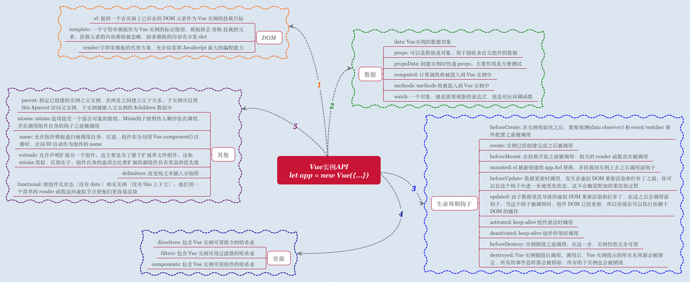
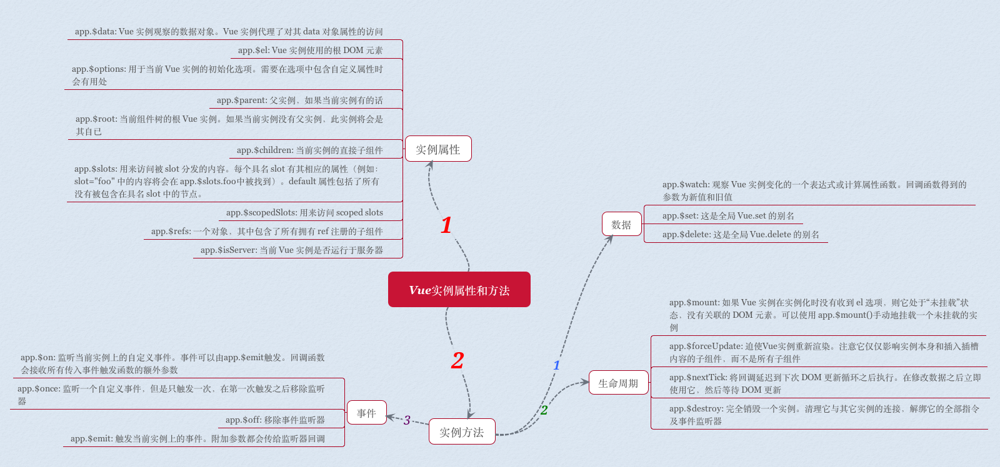
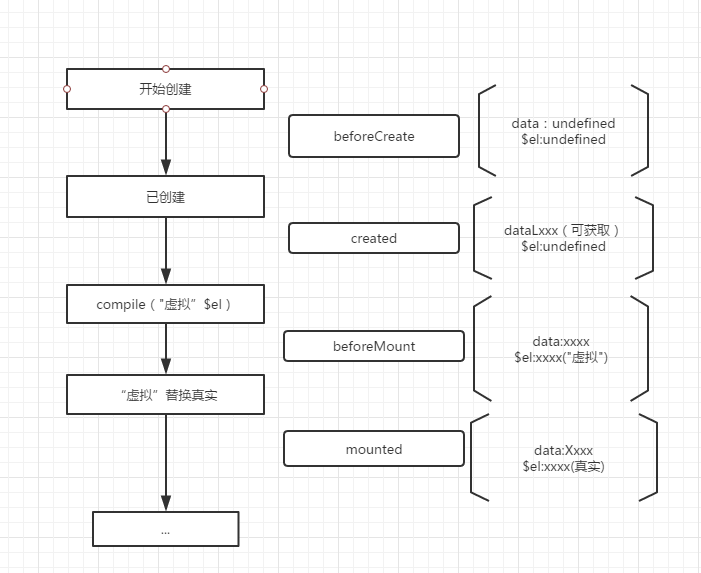

	https://juejin.im/post/5cf495e96fb9a07ef5622025
	公司要求会使用框架vue，面试题会被问及哪些？

# 知识点
## vue-cli
	vue init webpack projectName
	name description author build vue-router ESLint

## element-ui 
	npm install element-ui -S

	import Vue from 'vue'
	import Element from 'element-ui'

	Vue.use(Element)

	// or
	import {
	Select,
	Button
	// ...
	} from 'element-ui'

	Vue.component(Select.name, Select)
	Vue.component(Button.name, Button)


## 过渡
	vue提供了transition组件，用于给元素添加过渡效果：
	过渡过程：
	v-enter
	v-enter-active
	v-enter-to

	v-leave
	v-leave-active
	v-leave-to

## vue观察者 watch $watch
	https://www.w3cplus.com/vue/vue-watch.html
### 小结
	想要观察数据的变化和反应，通常会使用计算属性 computed；
	但是某些场景需要定制的监视程序（异步、大开销操作），则需要通过 观察者watch提供一个更通用的方法，来响应数据的变化；
	除了观察者watch，还提供了$watch实例方法（外部）
### $watch
	vm.$watch(expOrFun,callback,[option])
	app.$watch('count', function(newValue, oldValue){  }) // 注意：这里我们不能使用ES6的箭头函数，因为箭头函数被绑定到父的上下文，而this这个关键词将不会被正确绑定到Vue的实例。
	app.$watch('person.name.firstName'// 使用点方法访问到这个属性
	app.$watch('person.name', function(newValue, oldValue){  }, {deep: true}) //oldValue和newValue的值是一样的。这是因为当改变一个对象或数组（意味着在不创建新副本情况下修改它）时，oldValue和newValue的值将是相同的，因为Vue没有保留以前的值作为副本。因此，两个参数都引用同一个对象或数组。
	app.$watch( function () { return this.count }, function (newValue, oldValue) {   } ) //可以传入一个函数。这个函数应该简单地返回你希望监视更改的表达式著作权归作者所有。
	let unwatch = app.$watch( // 删除

## 过滤器
### 全局过滤器
	来看一个简单的示例。下面这个示例演示的是注册一个全局过滤器，其作用就是在价格前面加上美元符号：

	// 声明一个全局的过滤器
	Vue.filter('toUSD', function (value) { return `$${value}` })
	// 在模板中这样使用 文本插值的使用方式
	<div id="app">
		<h1>{{ price | toUSD}}</h1>
	</div>

### 本过过滤器
	本地过滤器被注册到一个Vue组件中。下面这个示例展示了本地过滤器是如何创建的。这个过滤器的功能是将字母变成大写：
	let app = new Vue({
		el: '#app',
		data () { return { name: 'w3cplus.com' } },
		filters: { Upper: function (value) { return value.toUpperCase() } }
	})
	<div id="app">
		<h1>{{ name | Upper }}</h1>
	</div>
### 添加参数
	// 声明一个全局的过滤器readMore
	// 这个过滤器传了三个参数：text, length, suffix | 文本 显示的长度 剩余表示
	Vue.filter('readMore', function (text, length, suffix) {
		return text.substring(0, length) + suffix
	})
	<div class="summary">{{ article.summary | readMore(100, '...') }}</div>
### 串联
	<h1>{{ price | toFixed(2) | toUSD }}</h1>

# VUE问题（面试）
## 知识点
### 不同路由修改页面的标题：设置afterEach钩子函数
	// 定义路由的时候如下定义，name也可为中文
	const routes = [
		{ path: '/goods', component: goods, name: 'goods' },
		{ path: '/ratings', component: ratings, name: 'ratings' },
		{ path: '/seller', component: seller, name: 'seller' }
	];
	// 创建路由实例
	const router = new VueRouter({
		routes: routes
	})
	// 关键在这里，设置afterEach钩子函数
	router.afterEach((to, from, next) => {
		document.title = to.name;
	})

### 怎样在刚进入应用就渲染某个路由组件  
	1.重定向  
		const routes = [ { path: '/', redirect: '/goods'} ]  
		const routes = [ { path: '/', redirect: { name: 'goods' }} ] //也可以是一个命名路由  
	2.导航式编程  
		router.push("/goods")

### how to define the vue router dynamic routing? And how to obtain the dynamic parameters?  
	对path属性加上id  
	通过router对象的params.id来获取动态值


### axios是什么？怎么使用？描述使用它实现登录功能的流程？
	请求后台资源的模块。
	npm install axios -S
	发送的是跨域，需在配置文件中config/index.js进行设置。
	后台如果是Tp5则定义一个资源路由。
	js中使用import进来，然后.get或.post。返回在.then函数中如果成功，失败则是在.catch函数中

### 自定义指令（v-check、v-focus）的方法有哪些？它有哪些钩子函数？还有哪些钩子函数参数？
	全局定义指令：在vue对象的directive方法里面有两个参数，一个是指令名称，另外一个是函数。
	组件内定义指令：directives
	钩子函数：bind（绑定事件触发）、inserted(节点插入的时候触发)、update（组件内相关更新）
	钩子函数参数：el、binding

### 对于MVVM的理解
	MVVM 是 Model-View-ViewModel 的缩写
	Model: 代表数据模型，也可以在Model中定义数据修改和操作的业务逻辑。我们可以把Model称为数据层，因为它仅仅关注数据本身，不关心任何行为
	View: 用户操作界面。当ViewModel对Model进行更新的时候，会通过数据绑定更新到View
	ViewModel： 业务逻辑层，View需要什么数据，ViewModel要提供这个数据；View有某些操作，ViewModel就要响应这些操作，所以可以说它是Model for View.
	总结： MVVM模式简化了界面与业务的依赖，解决了数据频繁更新。MVVM 在使用当中，利用双向绑定技术，使得 Model 变化时，ViewModel 会自动更新，而 ViewModel 变化时，View 也会自动变化。


### 请详细说下你对vue生命周期的理解？
	总共分为8个阶段创建前/后，载入前/后，更新前/后，销毁前/后
		创建前/后： 在beforeCreated阶段，vue实例的挂载元素$el和数据对象data都为undefined，还未初始化。在created阶段，vue实例的数据对象data有了，$el还没有。

		载入前/后：在beforeMount阶段，vue实例的$el和data都初始化了，但还是挂载之前为虚拟的dom节点，data.message还未替换。在mounted阶段，vue实例挂载完成，data.message成功渲染。

		更新前/后：当data变化时，会触发beforeUpdate和updated方法。

		销毁前/后：在执行destroy方法后，对data的改变不会再触发周期函数，说明此时vue实例已经解除了事件监听以及和dom的绑定，但是dom结构依然存在

### 请说下封装 vue 组件的过程？
	首先，组件可以提升整个项目的开发效率。能够把页面抽象成多个相对独立的模块，解决了我们传统项目开发：效率低、难维护、复用性等问题。
	然后，使用Vue.extend方法创建一个组件，然后使用Vue.component方法注册组件。子组件需要数据，可以在props中接受定义。而子组件修改好数据后，想把数据传递给父组件。可以采用emit方法。

### 你是怎么认识vuex的？
	vuex可以理解为一种开发模式或框架。比如PHP有thinkphp，java有spring等。通过状态（数据源）集中管理驱动组件的变化（好比spring的IOC容器对bean进行集中管理）。
	应用级的状态集中放在store中； 改变状态的方式是提交mutations，这是个同步的事物； 异步逻辑应该封装在action中。

### vue-loader是什么？使用它的用途有哪些？解析.vue文件的一个加载器，跟template/js/style转换成js模块。
	用途：js可以写es6、style样式可以scss或less、template可以加jade等

### 请说出vue.cli项目中src目录每个文件夹和文件的用法？
	assets文件夹是放静态资源；
	components是放组件；
	router是定义路由相关的配置;
	view视图；
	app.vue是一个应用主组件；
	main.js是入口文件


### template编译
	聊聊你对Vue.js的template编译的理解？简而言之，就是先转化成AST树，再得到的render函数返回VNode（Vue的虚拟DOM节点）
	详情步骤：
		首先，通过compile编译器把template编译成AST语法树（abstract syntax tree 即 源代码的抽象语法结构的树状表现形式），compile是createCompiler的返回值，createCompiler是用以创建编译器的。另外compile还负责合并option。
		然后，AST会经过generate（将AST语法树转化成render funtion字符串的过程）得到render函数，render的返回值是VNode，VNode是Vue的虚拟DOM节点，里面有（标签名、子节点、文本等等）

### 方法与事件处理
	<button @click="greet">Greet</button>
	methods: {
		greet: function(event) {
			console.log(event.target.tagName)
		}
	}
	<button :click="say('what')">Say What</button>
	methods: {
		say:  function(msg) {
			alert(msg)
		}
	}

### 事件修饰符
	在事件处理器中经常需要调用event.preventDefault 或 event.stopPropagation
		<a @click.stop="do"></a> // 阻止单击事件冒泡
		<a @submit.prevent="submit"></a> // 提交事件不再重载页面
		<a @click.stop.prevent="do"></a> // 修饰符可以串联
		<form @submit.prevent></form> // 只有修饰符
	在Vue中事件修饰符主要有：
		.stop：等同于JavaScript中的event.stopPropagation()，防止事件冒泡
		.prevent：等同于JavaScript中的event.preventDefault()，防止执行预设的行为（如果事件可取消，则取消该事件，而不停止事件的进一步传播）
		.capture：与事件冒泡的方向相反，事件捕获由外到内
		.self：只会触发自己范围内的事件，不包含子元素
		.once：只会触发一次
	按键修饰符
		.enter .tab .delete .esc .space .up .down .left .right
		<input v-on:keyup.13="submit">
		<input v-on:keyup.enter="submit">
		<input @keyup.enter="submit">
	自定义按键别名
		Vue.directive('on').keyCodes.f1 = 112 // 可以使用 @keyup.f1

### Vue 数组的数据更新
	https://www.mmxiaowu.com/article/58481e30d4352863efb55448
	在 Vue 中, 直接用索引设置元素，如 vm.items[0] = {}, 这样是不能更新试图的, 这时候就需要用$set方法
	this.list.$set(0, tmp)


### 响应式属性和方法
	每个 Vue 实例都会代理其 data 对象里所有的属性。
		var data = { a: 1 }
		var vm = new Vue({
			data: data
		})

		vm.a === data.a // -> true

		// 设置属性也会影响到原始数据
		vm.a = 2
		data.a // -> 2
		// ... 反之亦然
		data.a = 3
		vm.a // -> 3
	即：都可以使vm.xxx这种方式获取和修改实例属性。
	注意：只有这些被代理的属性是响应的。如果在实例创建之后添加新的属性到实例上，它不会触发视图更新。我们将在后面详细讨论响应系统。那么这种情况的话，可以使用VueJs的vm.$xxx的方式来修改实例属性，这同样会触发视图更新，响应式的改变。

### 插值
	单词插值，只有在第一次渲染时候渲染值，之后不会随实例属性值的变化而改变，如：
		<span>单词插值: {{* msg }}</span>
	插入原始HTML，这种方式内容以 HTML 字符串插入，数据绑定将被忽略，如：
		<div>{{{ raw_html }}}</div>
	如果需要复用模板片断，应当使用 partials
	注意： 在网站上动态渲染任意 HTML 是非常危险的，因为容易导致 XSS 攻击。记住，只对可信内容使用 HTML 插值，永不用于用户提交的内容。

### v-show 和 v-if的选择
	v-if 也是惰性的：如果在初始渲染时条件为假，则什么也不做——在条件第一次变为真时才开始局部编译（编译会被缓存起来）。
	相比之下，v-show 简单得多——元素始终被编译并保留，只是简单地基于 CSS 切换。

### 使用track-by，优化列表循环
	因为 v-for 默认通过数据对象的特征来决定对已有作用域和 DOM 元素的复用程度，这可能导致重新渲染整个列表。但是，如果每个对象都有一个唯一 ID 的属性，便可以使用 track-by 特性给 Vue.js 一个提示，Vue.js 因而能尽可能地复用已有实例。
	例如，假定数据为：
	{
		items: [
				{ _uid: '88f869d', ... },
				{ _uid: '7496c10', ... }
			]
	}
	然后可以这样给出提示：
	<div v-for="item in items" track-by="_uid">
		<!-### content -->
	</div>
	然后在替换数组 items 时，如果 Vue.js 遇到一个包含 _uid: ‘88f869d’ 的新对象，它知道它可以复用这个已有对象的作用域与 DOM 元素。

### prop数据绑定
	prop 默认是单向绑定：当父组件的属性变化时，将传导给子组件，但是反过来不会。这是为了防止子组件无意修改了父组件的状态——这会让应用的数据流难以理解。
	解决办法 : 使用 .sync 或.once 绑定修饰符显式地强制双向或单次绑定
	<!-### 默认为单向绑定 -->
	<child :msg="parentMsg"></child>
	<!-### 双向绑定 -->
	<child :msg.sync="parentMsg"></child>
	<!-### 单次绑定 -->
	<child :msg.once="parentMsg"></child>

### 组件的父链
	子组件可以用 this.$parent 访问它的父组件。根实例的后代可以用 this.$root 访问它。父组件有一个数组 this.$children，包含它所有的子元素。

### Vue和MVVM模式
	MVVM模式即Model-View-ViewModel。
	Vue是以数据为驱动的，Vue自身将DOM和数据进行绑定，一旦创建绑定，DOM和数据将保持同步，每当数据发生变化，DOM会跟着变化。
	ViewModel是Vue的核心，它是Vue的一个实例。Vue实例时作用域某个HTML元素上的，这个HTML元素可以是body，也可以是某个id所指代的元素。
	DOM Listeners和Data Bindings是实现双向绑定的关键。DOM Listeners监听页面所有View层DOM元素的变化，当发生变化，Model层的数据随之变化；Data Bindings监听Model层的数据，当数据发生变化，View层的DOM元素随之变化。

### Vue.js特点
	简洁：页面由HTML模板+Json数据+Vue实例组成
	数据驱动：自动计算属性和追踪依赖的模板表达式
	组件化：用可复用、解耦的组件来构造页面
	轻量：代码量小，不依赖其他库
	快速：精确有效批量DOM更新
	模板友好：可通过npm，bower等多种方式安装，很容易融入


### 一个简化vue的实现
    https://www.w3cplus.com/vue/vue-two-way-binding.html
    Vue的双向绑定原理及实现

    https://segmentfault.com/a/1190000019153289
    一张思维导图辅助你深入了解 Vue | Vue-Router | Vuex 源码架构

### mvvm模型
           -------------------
    view   |  dom listeners  |     model
           | data bingdings  |
           -------------------
    dom         VUe             plain js object

### vue 实例
    每个Vue的应用都是通过Vue()函数创建一个新的Vue实例开始的。创建了一个Vue实例，其实就创建了一个ViewModel。
    在vue的实例中，可以插入挂载元素 数据选项，还可以插入模板 方法 生命周期钩子...
        new Vue({})
        挂载元素  el:"#app"
        设置数据    data:{}
        模板渲染    {{title}}
        filters、computed、methods和watch


### Vue的双向数据绑定原理是什么？
#### 说明
	vue.js 是采用数据劫持结合发布者-订阅者模式的方式，通过Object.defineProperty()来劫持各个属性的setter，getter，在数据变动时发布消息给订阅者，触发相应的监听回调。
#### 具体步骤：
	第一步：需要observe的数据对象进行递归遍历，包括子属性对象的属性，都加上setter和getter这样的话，给这个对象的某个值赋值，就会触发setter，那么就能监听到了数据变化

	第二步：compile解析模板指令，将模板中的变量替换成数据，然后初始化渲染页面视图，并将每个指令对应的节点绑定更新函数，添加监听数据的订阅者，一旦数据有变动，收到通知，更新视图

	第三步：Watcher订阅者是Observer和Compile之间通信的桥梁，主要做的事情是:
		1、在自身实例化时往属性订阅器(dep)里面添加自己
		2、自身必须有一个update()方法
		3、待属性变动dep.notice()通知时，能调用自身的update()方法，并触发Compile中绑定的回调，则功成身退。

	第四步：MVVM作为数据绑定的入口，整合Observer、Compile和Watcher三者，
		通过Observer来监听自己的model数据变化，
		通过Compile来解析编译模板指令，
		最终利用Watcher搭起Observer和Compile之间的通信桥梁，达到数据变化 -> 视图更新；视图交互变化(input) -> 数据model变更的双向绑定效果。


## 原理
### vue生命周期面试题
	什么是vue生命周期？ 
		Vue实例从创建到销毁的过程，就是生命周期。也就是从开始创建、初始化数据、编译模板、挂载Dom→渲染、更新→渲染、卸载等一系列过程，我们称这是 Vue 的生命周期。
	vue生命周期的作用是什么？
		它的生命周期中有多个事件钩子，让我们在控制整个Vue实例的过程时更容易形成好的逻辑。
	vue生命周期总共有几个阶段？
		它可以总共分为8个阶段：创建前/后, 载入前/后,更新前/后,销毁前/销毁后
	第一次页面加载会触发哪几个钩子？
		第一次页面加载时会触发 beforeCreate, created, beforeMount, mounted 这几个钩子
	DOM 渲染在 哪个周期中就已经完成？
		DOM 渲染在 mounted 中就已经完成了
	简单描述每个周期具体适合哪些场景？
		生命周期钩子的一些使用方法： 
			beforecreate : 可以在这加个loading事件，在加载实例时触发 
			created : 初始化完成时的事件写在这里，如在这结束loading事件，异步请求也适宜在这里调用 
			mounted : 挂载元素，获取到DOM节点 
			updated : 如果对数据统一处理，在这里写上相应函数 
			beforeDestroy : 可以做一个确认停止事件的确认框 
			nextTick : 更新数据后立即操作dom

### vue实例参数
	Vue.js的组件可以理解为预先定义好了行为的ViewModel类。一个组件可以预定义很多选项，但最核心的是以下几个

	基础：
		模板template：
		初始数据data：一个组件的初始数据状态。对于可复用的组件来说，这通常是私有的状态。
		接受的外部参数：
			props：组件之间通过参数来进行数据的传递和共享。参数默认是单向绑定（由上至下），但也可以显式地声明为双向绑定
			propsData 

	其他：
		el render  |  computed methods watch
		私有资源：Vue.js当中将用户自定义的指令、过滤器、组件等统称为资源。由于全局注册资源容易导致命名冲突，一个组件可以声明自己的私有资源。私有资源只有该组件和它的子组件可以调用。

### 生命周期
    beforeCreate：在实例初始化之后，数据观测（Data Observer）和event/watcher事件配置之前被调用
    create：实例已经创建完成之后被调用。在这一步，实例已完成以下的配置：数据(Data Observer)、属性和方法的运算，watch/event事件回调。然而，挂载阶段还没开始，$el属性目前不可见
    beforeMount：在挂载开始之前被调用：相关的render函数首次被调用
    mounted：el被新创建的vm.$el替换，并挂载到实例上去之后调用该钩子。如果root实例挂载了一个文档内元素，当mounted被调用时vm.$el也在文档内
    beforeUpdate：数据更新时调用，发生在虚拟DOM重新渲染和打补丁之前。你可以在这个钩子中进一步地更改状态，这不会触发附加的重渲染过程
    updated：由于数据更改导致虚拟DOM重新渲染和打补丁，在这之后会调用该钩子。当这个钩子被调用时，组件DOM已经更新，所以你现在可以执行依赖于DOM的操作。然而在大多数情况下，你应该避免在此期间更改状态，因为这可能会导致更新无限循环。该钩子在服务器端渲染期间不被调用
    beforeDestroy：实例销毁之前调用。在这一步，实例仍然完全可用
    destroyed：Vue实例销毁后调用。调用后，Vue实例指示的所有东西都会解绑定，所有的事件监听器会被移除，所有的子实例也会被销毁。该钩子在服务器端渲染期间不被调用

### vue实例属性
    vm.$data      Vue实例观察的数据对象，vue实例代理了对其data对象的访问
    vm.$el        vue实例使用的根DOM元素
    vm.$option    用于当前vue实例的初始化选项 $options属性，它包含了数据、计算属性和方法等等
    vm.$parent    父实例
    vm.$children  
    vm.$root
    vm.$slots     用来访问被slot分发的内容，每个具名slot有其相应的属性[slot="foo"中的内容将会在app.$slots.foo中被找到]
    vm.$scopedSlots
    vm.$refs      包含了所有拥有ref注册的子组件
    vm.$isServe   当前vue实例是否运行与服务器

### vue实例方法
    事件 .$on .$off .$once .$emit
    数据 .$watch .$set .$delete [Vue.set Vue.delete]
    生命周期 
        vm.$mount      如果vue实例没有收到el设置，则处于未挂载状态，没有关联的DOM元素；可以使用app.$mount("#app")手动挂载一个未挂载的实例
        vm.$forceUpdate 使vue实例重新渲染，仅仅影响实例本身和插入插槽内容的额子组件
        vm.$nextTick   将回调延迟到下次DOM更新循环之后执行。在修改数据之后使用
        vm.$destroy    完全销毁一个vue实例（清理与其他实例的连接 解绑其它全部指令和事件监听器）

### 十个全局API和六个全局配置的API  [Vue构造函数静态方法]
    十个全局API：
        Vue.extend：使用基础Vue构造器，创建一个“子类”。参数是一个包含组件选项的对象
        Vue.nextTick：在下次DOM更新循环结束之后执行延迟回调。在修改数据之后立即使用这个方法，获取更新后的DOM
        Vue.set：设置对象的属性。如果对象是响应式的，确保属性被创建后也是响应式的，同时触发视图更新。这个方法主要用于避开Vue不能检测属性被添加的限制
        Vue.delete：删除对象的属性。如果对象是响应式的，确保删除能触发更新视图。这个方法主要用于避开Vue不能检测到属性被删除的限制，但是你应该很少会使用它
        Vue.directive：注册或获取全局指令
        Vue.filter：注册或获取全局过滤器
        Vue.component：注册或获取全局组件。注册还会自动使用给定的id设置组件的名称
        Vue.use：安装Vue.js插件
        Vue.mixin：全局注册一个混合，影响注册之后所有创建的每个Vue实例
        Vue.compile：在render函数中编译模板字符串。只在独立构建时有效

    六个全局Vue.config的API是：
        Vue.config.silent = true： 取消Vue所有的日志与警告
        Vue.config.optionMergeStrategies.methods：自定义合并策略的选项
        Vue.config.devtools = true：配置是否允许vue-devtools检查代码
        Vue.config.errorHandler = function(err, vm){}：指定组件的渲染和观察期间未捕获错误的处理函数
        Vue.config.ignoredElements = ['my-custom-web-component','another-web-component']：忽略在Vue之外的自定义元素
        Vue.config.keyCodes：给v-on自定义键位别名

### 图片





### vue总结原理性质总结
    https://juejin.im/post/5cd0bdfc6fb9a031f10ca08c#heading-17

    vue双向数据绑定
        vue.js 是采用'数据劫持'结合'发布者-订阅者模式'的方式，通过Object.defineProperty()来劫持各个属性的setter，getter，在数据变动时发布消息给订阅者，触发相应的监听回调。
        第一步：需要observe的数据对象进行递归遍历，包括子属性对象的属性，都加上 setter和getter。这样的话，给这个对象的某个值赋值，就会触发setter，那么就能监听到了数据变化；
        第二步：compile解析模板指令，将模板中的变量替换成数据，然后初始化渲染页面视图，并将每个指令对应的节点绑定更新函数，添加监听数据的订阅者，一旦数据有变动，收到通知，更新视图；
        第三步：Watcher订阅者是Observer和Compile之间通信的桥梁，主要做的事情是:
            1、在自身实例化时往属性订阅器(dep)里面添加自己
            2、自身必须有一个update()方法
            3、待属性变动dep.notice()通知时，能调用自身的update()方法，并触发Compile中绑定的回调，则功成身退。
        第四步：MVVM作为数据绑定的入口，整合Observer、Compile和Watcher三者，
            通过Observer来监听自己的model数据变化，
            通过Compile来解析编译模板指令，
            最终利用Watcher搭起Observer和Compile之间的通信桥梁，达到数据变化 -> 视图更新；视图交互变化(input) -> 数据model变更的双向绑定效果。


    vue生命周期的执行过程
        首先创建一个vue实例，Vue()；
        在创建Vue实例的时候，执行了init()，在init过程中首先调用了beforeCreate。
        Created之前，对data内的数据进行了数据监听，并且初始化了Vue内部事件。具体如下：
            1. 完成了数据观测；
            2. 完成了属性和方法的运算；
            3. 完成了watch/event事件的回调；
            4. 但是此时还未挂载dom上，$el属性是不可见的；

        beforeMount之前，完成了模板的编译。把data对象里面的数据和vue的语法写的模板编译成了html，但是此时还没有将编译出来的html渲染到页面；
            1. 在实例内部有template属性的时候，直接用内部的，然后调用render函数去渲染。
            2. 在实例内部没有找到template，就调用外部的html（“el”option（选项））。实例内部的template属性比外部的优先级高。 render函数 > template属性 > 外部html；
            3. 要是前两者都不满足，那么就抛出错误。

        Mounted之前执行了render函数，将渲染出来的内容挂载到了DOM节点上。mounted是将html挂载到页面完成后触发的钩子函数；当mounted执行完毕，整个实例算是走完了流程；在整个实例过程中，mounted仅执行一次；
        beforeUpdate：数据发生变化时，会调用beforeUpdate，然后经历virtual DOM，最后updated更新完成；
        beforeDestory是实例销毁前钩子函数，销毁了所有观察者，子组件以及事件监听；
        destoryed实例销毁执行的钩子函数；

    
    钩子函数
        beforeCreate：初始化了部分参数，如果有相同的参数，做了参数合并，执行 beforeCreate；el和数据对象都为undefined，还未初始化；
        created ：初始化了 Inject 、Provide 、 props 、methods 、data 、computed 和 watch，执行 created ；data有了，el还没有；
        beforeMount ：检查是否存在 el 属性，存在的话进行渲染 dom 操作，执行 beforeMount；$el和data都初始化了，但是dom还是虚拟节点，dom中对应的数据还没有替换；
        mounted ：实例化 Watcher ，渲染 dom，执行 mounted ；vue实例挂载完成，dom中对应的数据成功渲染；
        beforeUpdate ：在渲染 dom 后，执行了 mounted 钩子后，在数据更新的时候，执行 beforeUpdate ；
        updated ：检查当前的 watcher 列表中，是否存在当前要更新数据的 watcher ，如果存在就执行 updated ；
        beforeDestroy ：检查是否已经被卸载，如果已经被卸载，就直接 return 出去，否则执行 beforeDestroy ；
        destroyed ：把所有有关自己痕迹的地方，都给删除掉；

    Vue.js的template编译
    数据到视图的整体流程

    vue组件间的七种交互
        1. props和$emit
        2.特性绑定$attrs和$listeners
        3.中央事件总线 Events Bus
        4.依赖注入：provide和inject
        5.v-model
        6.子组件引用：ref和$refs
        7.父链和子索引：$parent和$children
        8.vue1中boradcast和dispatch
        9.vuex

    vuex原理
        vuex利用了vue的mixin机制，混合 beforeCreate 钩子 将store注入至vue组件实例上，并注册了 vuex store的引用属性 $store！
        vuex的state是借助vue的响应式data实现的。
        getter是借助vue的计算属性computed特性实现的。
        其设计思想与vue中央事件总线如出一辙。

    Vue-router 中hash模式和history模式的区别
        hash模式url里面永远带着#号，我们在开发当中默认使用这个模式。那么什么时候要用history模式呢？如果用户考虑url的规范那么就需要使用history模式，因为history模式没有#号，是个正常的url适合推广宣传。
        当然其功能也有区别，比如我们在开发app的时候有分享页面，那么这个分享出去的页面就是用vue或是react做的，咱们把这个页面分享到第三方的app里，有的app里面url是不允许带有#号的，所以要将#号去除那么就要使用history模式，但是使用history模式还有一个问题就是，在访问二级页面的时候，做刷新操作，会出现404错误，那么就需要和后端人配合让他配置一下apache或是nginx的url重定向，重定向到你的首页路由上就ok啦。
        路由的哈希模式其实是利用了window可以监听onhashchange事件，也就是说你的url中的哈希值（#后面的值）如果有变化，前端是可以做到监听并做一些响应（搞点事情），这么一来，即使前端并没有发起http请求他也能够找到对应页面的代码块进行按需加载。
        pushState与replaceState，这两个神器的作用就是可以将url替换并且不刷新页面，好比挂羊头卖狗肉，http并没有去请求服务器该路径下的资源，一旦刷新就会暴露这个实际不存在的“羊头”，显示404。这就需要服务器端做点手脚，将不存在的路径请求重定向到入口文件（index.html）。


### 虚拟dom
    让虚拟DOM和DOM-diff不再成为你的绊脚石
    https://juejin.im/post/5c8e5e4951882545c109ae9c

    总结：
        用JS对象模拟DOM（虚拟DOM）
        把此虚拟DOM转成真实DOM并插入页面中（render）
        如果有事件发生修改了虚拟DOM，比较两棵虚拟DOM树的差异，得到差异对象（diff）
        把差异对象应用到真正的DOM树上（patch）


### Vue插件的写法
https://www.cnblogs.com/luozhihao/p/7414419.html

```js
export default {
    install(Vue, options) {
        Vue.myGlobalMethod = function () {  // 1. 添加全局方法或属性，如:  vue-custom-element
            // 逻辑...
        }

        Vue.directive('my-directive', {  // 2. 添加全局资源：指令/过滤器/过渡等，如 vue-touch
            bind (el, binding, vnode, oldVnode) {
                // 逻辑...
            }
            ...
        })

        Vue.mixin({
            created: function () {  // 3. 通过全局 mixin方法添加一些组件选项，如: vuex
                // 逻辑...
            }

			methods: { // 会在每个组件实例中添加greetingFn方法,在单文件组件中可以直接通过this.greetingFn()调用
                greetingFn() {
                    console.log('greeting');
                }
            }
            ...
        })    

        Vue.prototype.$myMethod = function (options) {  // 4. 添加实例方法，通过把它们添加到 Vue.prototype 上实现
            // 逻辑...
        }
    }
}


// 插件的使用
Vue.use(MyPlugin);
```

### mode:history
	new Vue({
		mode: "history",//开启history模式保证spa可以和以前的网页一样可以前进和后退
	})


### qita
	koa-better-body 下载文件

	koa-covert
	covert(function*(){}) => promise

	koa koa-mysql
	


