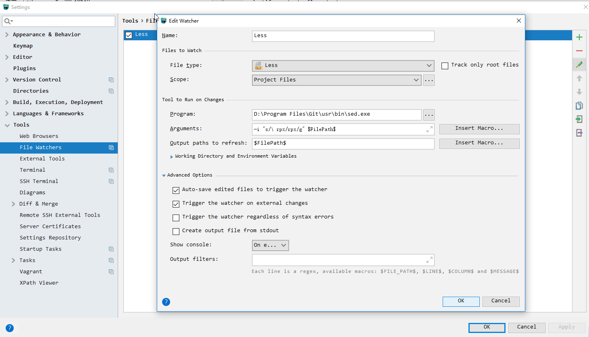

### webstrom对wcss的支持
设置codestyle

### WebStorm小程序开发，格式化样式文件时rpx前被添加空格的问题修复
使用WebStorm开发微信小程序，格式化样式文件时，带rpx的值格式化时总被空格分开，导致小程序样式错误

1. 解决方案：
    尝试修改WebStorm格式化代码的配置，查查之下，发现配置有限，未能解决 放弃
    通过FileWatcher动态修复 采纳
    
2. 解决步骤
    打开WebStorm配置，在Tools下找到File Watchers，自定义如下
    参数：-i "" s/"\ rpx"/rpx/g $FilePath$




### 古风歌曲
    寄明月
    风花雪月
    惊鸿一面
    我的一个道姑朋友
    山外小楼夜听雨

### 小程序
在控制台中可以输入以下命令

* build: 编译小程序
* preview: 预览
* upload: 上传代码
* openVendor: 打开基础库所在目录
* openToolsLog: 打开工具日志目录
* checkProxy(url): 检查指定 url 的代理使用情况


### 目录结构
    小程序包含一个描述整体程序的 app 和多个描述各自页面的 page。
    一个小程序主体部分由三个文件组成，必须放在项目的根目录，如下：
        app.js  	是	小程序逻辑
        app.json	是	小程序公共配置
        app.wxss	否	小程序公共样式表

    一个小程序页面由四个文件组成，分别是：
        js	    是	页面逻辑
        wxml	是	页面结构
        json	否	页面配置
        wxss	否	页面样式表

#### 允许上传的文件
    wxs png jpg jpeg gif svg json cer mp3 aac m4a mp4 wav ogg silk

#### 目录结构分析
    │  project.config.json
    │  README.md
    ├─cloudfunctions
    │  ├─login
    │  │      index.js
    │  │      package.json
    │  │
    │  └─sum
    │          index.js
    │          package.json
    │
    └─miniprogram
        │  app.js       小程序逻辑
        │  app.json     小程序公共配置
        │  app.wxss     小程序公共样式表
        │
        ├─images
        │      code-db-inc-dec.png
        │
        ├─pages
        │  ├─addFunction
        │  │      addFunction.js
        │  │      addFunction.json
        │  │      addFunction.wxml
        │  │      addFunction.wxss
        │  │
        │  ├─index
        │  │      index.js              
        │  │      index.wxml            
        │  │      index.wxss
        │  │      user-unlogin.png
        │
        └─style
                guide.wxss


    
## 运行流程 App -> Page
### App
微信客户端在打开小程序之前，会把整个小程序的代码包下载到本地。 紧接着通过 app.json 的 pages 字段就可以知道你当前小程序的所有页面路径:

```
{
    "pages":[
        "pages/index/index",
        "pages/logs/logs"
    ]
}

这个配置说明在 QuickStart 项目定义了两个页面，分别位于 pages/index/index 和 pages/logs/logs。而写在 pages 字段的第一个页面就是这个小程序的首页（打开小程序看到的第一个页面）。

于是微信客户端就把首页的代码装载进来，通过小程序底层的一些机制，就可以渲染出这个首页。
```

小程序启动之后，在 app.js 定义的 App 实例的 onLaunch 回调会被执行: App({ onLaunch: function () { } })// 小程序启动之后触发

整个小程序只有一个 App 实例，是全部页面共享的

#### 小程序生命周期回调
[小程序的生命周期回调](https://developers.weixin.qq.com/miniprogram/dev/framework/app-service/app.html)

```
App({
  onLaunch (options) {
    // Do something initial when launch. // 生命周期回调—监听小程序初始化	小程序初始化完成时（全局只触发一次）
  },
  onShow (options) { 
    // Do something when show. // 生命周期回调—监听小程序显示	小程序启动，或从后台进入前台显示时
  },
  onHide () {
    // Do something when hide. // 生命周期回调—监听小程序隐藏	小程序从前台进入后台时
  },
  onError (msg) {
    console.log(msg) // 错误监听函数	小程序发生脚本错误，或者 api 调用失败时触发，会带上错误信息
  },
  onPageNotFound (){ 
    wx.redirectTo({
      url: 'pages/...'
    }) // 如果是 tabbar 页面，请使用 wx.switchTab 小程序要打开的页面不存在时触发。也可以使用 wx.onPageNotFound  绑定监听。
  }, 
  globalData: 'I am global data'
})
```
#### 实例
全局的 getApp() 函数可以用来获取到小程序 App 实例。    

注意：
* 不要在定义于 App() 内的函数中调用 getApp() ，使用 this 就可以拿到 app 实例。
* 通过全局函数 getApp() 获取实例之后，不要私自调用生命周期函数
```
// other.js
var appInstance = getApp()
console.log(appInstance.globalData) // I am global data
```

### Page
#### 页面的渲染流程
微信客户端会先根据 logs.json 配置生成一个界面，顶部的颜色和文字你都可以在这个 json 文件里边定义好。紧接着客户端就会装载这个页面的 WXML 结构和 WXSS 样式。最后客户端会装载 logs.js，你可以看到 logs.js 的大体内容就是:

```
Page({
  data: { // 参与页面渲染的数据
    logs: []
  },
  onLoad: function () {
    // 页面渲染后 执行
  }
})
```

Page 是一个页面构造器，这个构造器就生成了一个页面。在生成页面的时候，小程序框架会把 data 数据和 index.wxml 一起渲染出最终的结构，于是就得到了你看到的小程序的样子。

在渲染完界面之后，页面实例就会收到一个 onLoad 的回调，你可以在这个回调处理你的逻辑。

### Page构造器

```
//index.js
Page({
  data: {
    text: "This is page data."
  },
  onLoad: function(options) {
    // Do some initialize when page load.
  },

  onShow: function() {
    console.log(this.route) // 到当前页面的路径，类型为String
  }

  // Event handler.
  viewTap: function() {
    this.setData({
      text: 'Set some data for updating view.'
    }, function() {
      // this is setData callback
    })
  },
  customData: {
    hi: 'MINA'
  }
})
```

| data              | Object   | 页面的初始数据                                                                   | 参数                  |
| ----------------- | -------- | -------------------------------------------------------------------------------- | --------------------- |
| onLoad            | Function | 生命周期回调—监听页面加载 {query}                                               |
| onShow            | Function | 生命周期回调—监听页面显示                                                       |
| onReady           | Function | 生命周期回调—监听页面初次渲染完成                                               |
| -                 | -        | 一个页面只会调用一次，代表页面已经准备妥当，可以和视图层进行交互。               |
| -                 | -        | 注意：对界面内容进行设置的 API 如wx.setNavigationBarTitle，请在onReady之后进行。 |
| onHide            | Function | 生命周期回调—监听页面隐藏                                                       |
| onUnload          | Function | 生命周期回调—监听页面卸载                                                       |
| onPullDownRefresh | Function | 监听用户下拉动作                                                                 |
| onReachBottom     | Function | 页面上拉触底事件的处理函数                                                       |
| onShareAppMessage | Function | 用户点击右上角转发                                                               |
| onPageScroll      | Function | 页面滚动触发事件的处理函数                                                       | {scrollTop}           |
| onResize          | Function | 页面尺寸改变时触发，详见 响应显示区域变化                                        |
| onTabItemTap      | Function | 当前是 tab 页时，点击 tab 时触发                                                 | {index pagePath text} |


## 其他
### 组件
可以传递属性值给组件、可以添加回调函数、可以通过 style 或者 class 来控制组件的外层样式

```html
<map></map>
<map longitude="广州经度" latitude="广州纬度"></map>
<map bindmarkertap="markertap" longitude="广州经度" latitude="广州纬度"></map>
```
#### 基础组件
[基础组件](https://developers.weixin.qq.com/miniprogram/dev/component/)

* 视图容器  view scroll-view swiper movable-view/movable-aera cover-view cover-image	
* 基础内容 icon text rich-text progress	
* 表单 button checkbox form input label picker picker-view radio slider switch textarea	
* 导航 navigator functional-page-navigator	
* 多媒体 audio image video camera live-player live-pusher	
* 画布 canvas
* 开放能力  open-data web-view ad official-account	


### 场景库
[场景库](https://developers.weixin.qq.com/miniprogram/dev/framework/app-service/scene.html)

部分场景值下还可以获取来源应用、公众号或小程序的appId。
* 对于小程序，可以在 App 的 onLaunch 和 onShow，或wx.getLaunchOptionsSync 中获取上述场景值。
* 对于小游戏，可以在 wx.getLaunchOptionsSync 和 wx.onShow 中获取上述场景值

### 路由
    在小程序中所有页面的路由全部由框架进行管理。

    框架以栈的形式维护了当前的所有页面。 当发生路由切换的时候，页面栈的表现如下：
        路由方式	页面栈表现
        初始化	新页面入栈
        打开新页面	新页面入栈
        页面重定向	当前页面出栈，新页面入栈
        页面返回	页面不断出栈，直到目标返回页
        Tab 切换	页面全部出栈，只留下新的 Tab 页面
        重加载	页面全部出栈，只留下新的页面

#### getCurrentPages()
getCurrentPages() 函数用于获取当前页面栈的实例，以数组形式按栈的顺序给出，第一个元素为首页，最后一个元素为当前页面。

#### 注意：
* 不要尝试修改页面栈，会导致路由以及页面状态错误。
* 不要在 App.onLaunch 的时候调用 getCurrentPages()，此时 page 还没有生成。

#### 路由方式
对于路由的触发方式以及页面生命周期函数如下：

| 路由方式   | 触发时机                                                                                      | 路由前页面 | 路由后页面         |
| ---------- | --------------------------------------------------------------------------------------------- | ---------- | ------------------ |
| 初始化     | 小程序打开的第一个页面                                                                        | --         | onLoad, onShow     |
| 打开新页面 | 调用 API wx.navigateTo 或使用组件 <navigator open-type="navigateTo"/>                         | onHide     | onLoad, onShow     |
| 页面重定向 | 调用 API wx.redirectTo 或使用组件 <navigator open-type="redirectTo"/>                         | onUnload   | onLoad, onShow     |
| 页面返回   | 调用 API wx.navigateBack 或使用组件<navigator open-type="navigateBack">或用户按左上角返回按钮 | onUnload   | onShow             |
| Tab 切换   | 调用 API wx.switchTab 或使用组件 <navigator open-type="switchTab"/> 或用户切换 Tab            | --         | 各种情况请参考下表 |
| 重启动     | 调用 API wx.reLaunch 或使用组件 <navigator open-type="reLaunch"/>                             | onUnload   | onLoad, onShow     |

Tab 切换对应的生命周期（以 A、B 页面为 Tabbar 页面，C 是从 A 页面打开的页面，D 页面是从 C 页面打开的页面为例）：
 
| 当前页面        | 路由后页面    | 触发的生命周期（按顺序）                           |
| --------------- | ------------- | -------------------------------------------------- |
| A               | A             | Nothing happend                                    |
| A               | B             | A.onHide(), B.onLoad(), B.onShow()                 |
| A               | B（再次打开） | A.onHide(), B.onShow()                             |
| C               | A             | C.onUnload(), A.onShow()                           |
| C               | B             | C.onUnload(), B.onLoad(), B.onShow()               |
| D               | B             | D.onUnload(), C.onUnload(), B.onLoad(), B.onShow() |
| D（从转发进入） | A             | D.onUnload(), A.onLoad(), A.onShow()               |
| D（从转发进入） | B             | D.onUnload(), B.onLoad(), B.onShow()               |

#### Tips:
* navigateTo, redirectTo 只能打开非 tabBar 页面。
* switchTab 只能打开 tabBar 页面。
* reLaunch 可以打开任意页面。
* 页面底部的 tabBar 由页面决定，即只要是定义为 tabBar 的页面，底部都有 tabBar。
* 调用页面路由带的参数可以在目标页面的onLoad中获取。


### 模块化
可以将一些公共的代码抽离成为一个单独的 js 文件，作为一个模块。模块只有通过 module.exports 或者 exports 才能对外暴露接口。

```javascript
module.exports.sayHello = sayHello
exports.sayGoodbye = sayGoodbye

var common = require('common.js')
common.sayGoodbye('MINA')
common.sayHello('MINA')
```

小程序目前不支持直接引入 node_modules , 开发者需要使用到 node_modules 时候建议拷贝出相关的代码到小程序的目录中或者使用小程序支持的 [npm](https://developers.weixin.qq.com/miniprogram/dev/devtools/npm.html) 功能


### api
[API 文档](https://developers.weixin.qq.com/miniprogram/dev/api/index.html)

在小程序 API 有以下几种类型

#### 事件监听 API
我们约定，以 on 开头的 API 用来监听某个事件是否触发，如：wx.onSocketOpen，wx.onCompassChange 等。

这类 API 接受一个回调函数作为参数，当事件触发时会调用这个回调函数，并将相关数据以参数形式传入。

```
wx.onCompassChange(function (res) {
  console.log(res.direction)
})
```

#### 同步 API
我们约定，以 Sync 结尾的 API 都是同步 API， 如 wx.setStorageSync，wx.getSystemInfoSync 等。此外，也有一些其他的同步 API，如 wx.createWorker，wx.getBackgroundAudioManager 等，详情参见 API 文档中的说明。

同步 API 的执行结果可以通过函数返回值直接获取，如果执行出错会抛出异常。
```
try {
  wx.setStorageSync('key', 'value')
} catch (e) {
  console.error(e)
}
```

#### 异步 API
大多数 API 都是异步 API，如 wx.request，wx.login 等。这类 API 接口通常都接受一个 Object 类型的参数，这个参数都支持按需指定以下字段来接收接口调用结果;

success，fail，complete 函数调用时会传入一个 Object 类型参数，包含以下字段errMsg、errCode、其他

异步 API 的执行结果需要通过 Object 类型的参数中传入的对应回调函数获取。部分异步 API 也会有返回值，可以用来实现更丰富的功能，如 wx.request，wx.connectSockets 

`wx.login({ success(res) { console.log(res.code) } })`

```javascript
wx.api({
  success:(obj)=>{ // { errMsg errCode ...}
    
  },
  
  fail:()=>{
    
  },
  complete:()=>{
    
  },
  other:()=>{
    
  },
})
```

#### demo
获取用户的地理位置时，只需要：
```
wx.getLocation({
  type: 'wgs84',
  success: (res) => {
    var latitude = res.latitude // 纬度
    var longitude = res.longitude // 经度
  }
})

```

调用微信扫一扫能力，只需要：
```
wx.scanCode({
  success: (res) => {
    console.log(res)
  }
})

```

### wxml
```html
<view> {{ message }} </view>

<view wx:if="{{condition}}"> </view>
<view wx:if="{{length > 5}}"> </view>

<view wx:if="{{length > 5}}"> 1 </view>
<view wx:elif="{{length > 2}}"> 2 </view>
<view wx:else> 3 </view>

<view hidden="{{flag ? true : false}}"> Hidden </view> 

wx:if 也是惰性的，如果在初始渲染条件为 false，框架什么也不做，在条件第一次变成真的时候才开始局部渲染
hidden 组件始终会被渲染，只是简单的控制显示与隐藏
如果需要频繁切换的情景下，用 hidden 更好，如果在运行时条件不大可能改变则 wx:if 较好

<view> {{a + b}} + {{c}} + d </view>
<view>{{"hello" + name}}</view>
<view>{{object.key}} {{array[0]}}</view>

<view wx:for="{{[zero, 1, 2, 3, 4]}}"> {{item}} </view>

<template is="objectCombine" data="{{for: a, bar: b}}"></template>
<template is="objectCombine" data="{{...obj1, ...obj2, e: 5}}"></template>
<template is="objectCombine" data="{{foo, bar}}"></template>  对象的 key 和 value 相同，也可以间接地表达
<template is="objectCombine" data="{{...obj1, ...obj2, a, c: 6}}"></template>  如有存在变量名相同的情况，后边的会覆盖前面
```
#### v-for
```html
标变量名默认为 index，数组当前项的变量名默认为 item
<view wx:for="{{objectArray}}">
  {{index}}: {{item.message}}
</view>

使用 wx:for-item 可以指定数组当前元素的变量名， 使用 wx:for-index 可以指定数组当前下标的变量名：
<view wx:for="{{objectArray}}" wx:for-index="idx" wx:for-item="itemName">
  {{idx}}: {{itemName.message}}
</view>

嵌套
<view wx:for="{{[1, 2, 3, 4, 5, 6, 7, 8, 9]}}" wx:for-item="i">
  <view wx:for="{{[1, 2, 3, 4, 5, 6, 7, 8, 9]}}" wx:for-item="j">
    <view wx:if="{{i <= j}}">
      {{i}} * {{j}} = {{i * j}}
    </view>
  </view>
</view>

<switch wx:for="{{objectArray}}" wx:key="uniqueKeyName" style="display: block;"> {{item.id}} </switch>
<switch wx:for="{{[1, 2, 3, 4]}}" wx:key="*this" style="display: block;"> {{item}} </switch>

注意： 花括号和引号之间如果有空格，将最终被解析成为字符串
<view wx:for="{{[1,2,3]}} "> {{item}} </view>
等同于
<view wx:for="{{[1,2,3] + ' '}}"> {{item}} </view>
```
#### template
* 定义模板: 使用 name 属性，作为模板的名字。然后在<template/>内定义代码片段。
* 使用模板： 使用 is 属性，声明需要的使用的模板，然后将模板所需要的 data 传入。

```html
<!--
   data: {
    item: { index: 0, msg: 'this is a template', time: '2016-09-15' }
  }
-->
<template name="msgItem">
  <view>
    <text> {{index}}: {{msg}} </text>
    <text> Time: {{time}} </text>
  </view>
</template>

<template is="msgItem" data="{{...item}}"/>

```

```html
<template name="odd">
  <view> odd </view>
</template>
<template name="even">
  <view> even </view>
</template>

<block wx:for="{{[1, 2, 3, 4, 5]}}">
	<template is="{{item % 2 == 0 ? 'even' : 'odd'}}"/>
</block>
```

#### 事件


