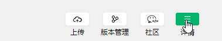
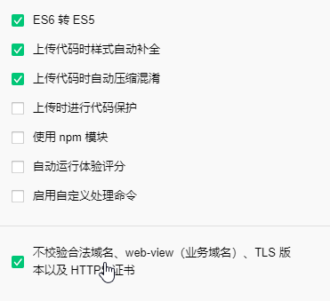

### www

    https://github.com/justjavac/awesome-wechat-weapp
    微信小程序开发资源汇总

    https://github.com/finalvip/weapp_template
    一些设计稿

    https://www.cnblogs.com/jiqing9006/category/764776.html
    https://www.cnblogs.com/jiqing9006/tag/小程序/
    小程序使用技巧 系列 

    https://juejin.im/post/5cfdcf056fb9a07ecd3d5068
    小程序开发：用原生还是选框架（wepy/mpvue/uni-app/taro）

    
### 其他教程
    https://github.com/ljybill/miniprogram-utils
    微信小程序开发过程中积累的一些代码

    https://github.com/flymysql/WeChat-applets
    微信小程序小鸡单词

    https://github.com/Andyliwr/mbook
    毕业设计--基于微信小程序的在线免费小说应用

    https://github.com/zhanghanjun664/tww_test2
    微信小程序 组件使用小测试

    https://github.com/yukiyang0729/blog/issues/3
    【小程序】接入NPM包开发实践
    
### taro
    https://github.com/NervJS/awesome-taro
    多端统一开发框架 Taro 优秀学习资源汇总

    https://github.com/NervJS/taro-ui
    一款基于 Taro 框架开发的多端 UI 组件库 

    实践：
        https://juejin.im/post/5b3b786a6fb9a04f89780a9f
        Taro实践 - TOPLIFE小程序 开发体验

        http://taro-ext.jd.com/plugin/view/5caaec4e2abc2f003f6af580
        基于Taro-ui + dva公益App

        https://blog.csdn.net/sinat_17775997/article/details/83062972
        https://www.jianshu.com/p/71e209987c83
        基于Taro + Dva构建的适配不同端（微信小程序、H5、React-Native 等）的时装衣橱
        
        https://github.com/zuoge85/taro-dva
        整合 taro-dvajs的仿知乎示例 


### 小程序组件化开发及工程化开发
    https://github.com/youzan/vant-weapp
    https://youzan.github.io/vant-weapp
    有赞的小程序组件


### 小程序使用 async await
    https://juejin.im/post/5c14b253e51d452f8e603896

    到facebook的开源库regenerator 下载'packages/regenerator-runtime'这个路径下的runtime.js，放到自己小程序项目下的utils或者lib文件夹下。
    https://github.com/facebook/regenerator/tree/master/packages

```js
import regeneratorRuntime from '../../utils/runtime.js'

onLoad: function() {
    this.initData();
}

async initData(){
    await this.initMyData();//请求接口1
    await this.initTodayData();//请求接口2
}
```

### 访问本地API设置
勾选设置:不校验合法域名、web-view（业务域名）、TLS 版本以及 HTTPS 证书





### cover-view使用

```html
<cover-view class="bg-wrap"
            bindtap="onDictTap"
            data-dict-name="{{item.name}}">
    <cover-image class="bg-img" src="../../images/bg.jpg" bindtap="onDictTap"
                    data-dict-name="{{item.name}}"/>
</cover-view>
<cover-view class="text-wrap"
            bindtap="onDictTap"
            data-dict-name="{{item.name}}">
    <view class='text-li'
            wx:key="{{idx}}"
            wx:for="{{item.nameArr}}">
        {{item}}
    </view>
</cover-view>
```

```css
.bg-wrap {
    position: absolute;
    top: 0;
    left: 0;
    height: 100%;
    width: 100%;
}

.text-wrap {
    position: absolute;
    padding: 10px 20px 10px 10px;
    top: 0;
    left: 0;
    display: flex;
    flex-flow: column wrap;
    justify-content: flex-start;
    align-items: flex-end;
    width: 100%;
    height: 100%;
    color: rgba(0, 0, 0, 0.72);
    font-weight: bolder;

    font-family: 楷体;
    text-align: center;

    /*writing-mode: tb-rl;*/
    white-space: normal;
}

.text-li {
    z-index: 2;
    min-width: 30px;
}
```
### 微信小程序，使用本地图片作为背景
    微信小程序中由于限制原因，不能直接给view设置本地的图片。所以有以下几种解决方法
    1. 使用网络图片
    2. 使用base64格式
    3. 使用image来装载本地的图片，然后作为 界面背景

```html
<view class="root">
  <image class='background-image' src='../res/login_bg.png' mode="aspectFill"></image>
  <view class="content">
  </view>
</view>
```

```css
.root {
   width: 100%;
    height: 100%;
    background-color: #70c7da;
    position: relative;
}

.background-image{
   height : 100%;
    position: absolute;
    width: 100%;
    left: 0px;
    top: 0px;
}
.content{
    position: absolute;
    width: 100%;
    height: 100%;
    left: 0px;
    top: 0px;
}
```

### onShareAppMessage 分享 转发
    在页面的js文件中定义了 onShareAppMessage 函数时，页面可以表示改页面可以转发。可以在函数中设置页面转发的信息。

    只有定义了该函数，小程序右上角的菜单中才会有转发按钮
    用户点击转发按钮的时候回调用该函数
    该函数内需要 return 一个 Object，Object中包含转发的信息（可自定义转发的内容）

    页面中有可以触发转发时间的地方有两个：
    　　1. 一个是右上角菜单中的转发按钮
    　　2. 另一个是页面中具有属性open-type且其值为share的button。（注：必须是button组件，其他组件中设置 open-type="share" 无效）
    　　    即：<button data-name="shareBtn" open-type="share">转发</button>

    　　注意：实际开发中会发现这个 button 自带有样式，当背景颜色设置为白色的时候还有一个黑色的边框，刚开始那个边框怎么都去不掉，后来给button加了一个样式属性 plain="true" 以后，再在样式文件中控制样式 button[plain]{ border:0 } ，就可以比较随便的自定义样式了，比如说将分享按钮做成一个图标等

    触发分享事件后调用的函数：

```js
  onShareAppMessage: function (options) {
    // 设置菜单中的转发按钮触发转发事件时的转发内容
    var shareObj = {
      title: '转发的标题',        // 默认是小程序的名称(可以写slogan等)
      path: '/pages/share/share',        // 默认是当前页面，必须是以‘/’开头的完整路径
      imageUrl: '',     //自定义图片路径，可以是本地文件路径、代码包文件路径或者网络图片路径，支持PNG及JPG，不传入 imageUrl 则使用默认截图。显示图片长宽比是 5:4
      success: function (res) {
        // 转发成功之后的回调
        if (res.errMsg == 'shareAppMessage:ok') {
        }
      },
      fail: function () {
        // 转发失败之后的回调
        if (res.errMsg == 'shareAppMessage:fail cancel') {
          // 用户取消转发
        } else if (res.errMsg == 'shareAppMessage:fail') {
          // 转发失败，其中 detail message 为详细失败信息
        }
      },
      complete: function () {
        // 转发结束之后的回调（转发成不成功都会执行）
      },
    }
    // 来自页面内的按钮的转发
    if (options.from == 'button') {
      var eData = options.target.dataset
      console.log(eData.name)     // shareBtn
      // 此处可以修改 shareObj 中的内容
      shareObj.path = '/pages/btnname/btnname?btn_name=' + eData.name
    }
    // 返回shareObj
    return shareObj
  },
```


### 自定义顶部导航栏
```js
{
    "window": {
        "navigationStyle": "custom"
    },
}
// 内部
{
    "navigationStyle": "custom"
}
```

### 小程序点击事件冒泡
    简单小程序自身提供了相应的方法：
    1.   catchtap：和bindtap相对应，catchtap有着阻止事件冒泡的作用；
    2.   catchtouchmove：阻止浮层欢动穿透到页面上，这里用到了scroll-view就顺带提一下，这是小程序组件视图容器，表示可滚动视图区域。

### 小程序中实现点击一个转发按钮
    小程序中实现点击一个转发按钮，携带当前点击参数，转发另一个页面的功能
    https://blog.csdn.net/liya_nan/article/details/81634695

### 添加到我的小程序 「添加到我的小程序」
    https://github.com/guren-cloud