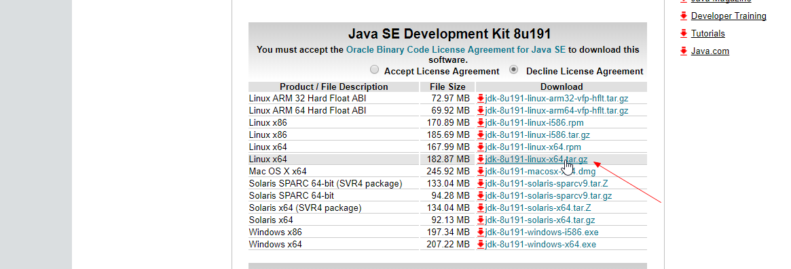
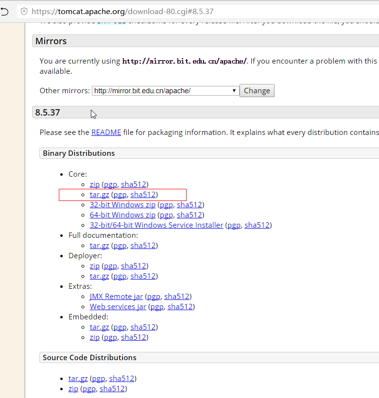

### jdk tomacat

#### 下载

http://www.oracle.com/technetwork/java/javase/downloads/jdk8-downloads-2133151.html



https://download.oracle.com/otn-pub/java/jdk/8u191-b12/2787e4a523244c269598db4e85c51e0c/jdk-8u191-linux-x64.tar.gz?AuthParam=1546870506_6bb98c0783b03b2c4851433096cbaa22

http://tomcat.apache.org/




http://mirrors.shu.edu.cn/apache/tomcat/tomcat-8/v8.5.37/bin/apache-tomcat-8.5.37.tar.gz


#### wget下载
```
wget http://download.oracle.com/otn-pub/java/jdk/8u131-b11/d54c1d3a095b4ff2b6607d096fa80163/jdk-8u131-linux-x64.tar.gz?AuthParam=1498630374_ed6e8b60e10c2fa6bd317a72378bf086
wget http://mirrors.tuna.tsinghua.edu.cn/apache/tomcat/tomcat-8/v8.5.4/bin/apache-tomcat-8.5.4.tar.gz
```

#### JDK
```
JDK解压
tar -zxvf jdk-8u101-linux-x64.tar.gz
mkdir /usr/local/java
mv jdk-8u101-linux-x64/* /usr/local/java

配置环境
vim /etc/profile

    在文件末尾添加内容:
    export JAVA_HOME=/usr/local/java
    export JAVA_BIN=$JAVA_HOME/bin
    export PATH=$PATH:$JAVA_HOME/bin
    export CLASSPATH=.:$JAVA_HOME/lib/dt.jar:$JAVA_HOME/lib/tools.jar
    export PATH=$JAVA_HOME/bin:$JRE_HOME/bin:$PATH

使配置修改生效
source /etc/profile

测试java是否生效
java -version
```

#### tomcat
    Tomcat解压
    tar -zxvf apache-tomcat-8.5.4.tar.gz
    mkdir /usr/local/tomcat
    mv apache-tomcat-8.5.4/* /usr/local/tomcat


    启动关闭Tomcat
    cd /usr/local/tomcat/bin
    ./startup.sh
    ./shutdown.sh

    查看Tomcat是否以关闭
    ps -ef|grep java

        Tomcat还没有关闭状态:
        root      7010     1  0 Apr19 ?        00:30:13 /usr/local/java/bin/java
        -Djava.util.logging.config.file=/usr/local/tomcat/conf/logging.properties
        -Djava.awt.headless=true -Dfile.encoding=UTF-8 -server -Xms1024m -Xmx1024m
        -XX:NewSize=256m -XX:MaxNewSize=256m -XX:PermSize=256m -XX:MaxPermSize=256m
        -XX:+DisableExplicitGC -Djava.util.logging.manager=org.apache.juli.ClassLoaderLogManager
        -Djava.endorsed.dirs=/usr/local/tomcat/endorsed -classpath /usr/local/tomcat/bin/bootstrap.jar
        -Dcatalina.base=/usr/local/tomcat -Dcatalina.home=/usr/local/tomcat
        -Djava.io.tmpdir=/usr/local/tomcat/temp org.apache.catalina.startup.Bootstrap start

    想直接直接杀死Tomcat进程（进程号： 7010），可以使用kill命令 
    kill -9 7010

    然后继续查看Tomcat是否关闭  
    ps -ef|grep java

        tomcat关闭状态
        root      7010     1  0 Apr19 ?        00:30:30 [java] <defunct>
    
    通过curl命令，查看在服务器上是否能直接访问tomcat
    curl http://7.104.137.378:8989 


#### tomcat 其他

1. 配置Web管理账号,在元素中添加帐号密码,需要指定角色
vim /usr/local/tomcat/conf/tomcat-users.xml
```html
<tomcat-users>
 <user name="admin" password="admin" roles="admin-gui,manager-gui" />
</tomcat-users>
```

1. 配置端口(Tomcat的默认端口是8080)(修改后需要重启)
vim /usr/local/tomcat/conf/server.xml
```html
<Connector port="9999" protocol="HTTP/1.1" connectionTimeout="20000" redirectPort="8443" /> 
```

3. 防火墙开启端口
      /sbin/iptables -I INPUT -p tcp --dport 8080 -j ACCEPT
      service iptables save
      service iptables restart

      或直接修改文件/etc/sysconfig/iptables.
      vi /etc/sysconfig/iptables
      -A INPUT -p tcp -m tcp --dport 8080 -j ACCEPT

      service iptables restart
      在浏览器输入: http://192.168.16.133:8080
      如在本机可以输入: http://localhost:8080

4. 配置https Tomcat的目录结构 webapps目录结构: https://blog.csdn.net/lcyaiym/article/details/76696192


### 防火墙相关

#### 端口访问不了检查
    1. 本地打开cmd,输入ping 7.104.137.378,该ip地址正常连接；
    2.  查看防火墙是否已关闭 ufw status 
    3.  设置防火墙，执行 ufw allow 8989/tcp命令，允许防火墙放过8989端口。
    4. 查看8989口段是否正常被监听
        netstat -an | grep 8989 
        显示信息如下，表示该端口被正常监听。 tcp 0 0 0.0.0.0:8989 0.0.0.0:* LISTEN
    5. 阿里云的实例安全组，要配置我设置的8989端口


#### iptables
    linux 查看并对外开放端口（防火墙拦截处理）
    https://www.cnblogs.com/blog-yuesheng521/p/7198829.html

    查看端口是否可访问：telnet ip 端口号 （如本机的35465：telnet localhost 35465）
    开放的端口位于/etc/sysconfig/iptables中
    查看时通过 more /etc/sysconfig/iptables 命令查看

    如果想开放端口（如：8889）
      （1）通过vi /etc/sysconfig/iptables 进入编辑增添一条-A INPUT -p tcp -m tcp --dport 8889 -j ACCEPT 即可
      （2）执行 /etc/init.d/iptables restart 命令将iptables服务重启
      （3）保存 /etc/rc.d/init.d/iptables save

    如若不想修改iptables表，可以直接输入下面命令：
      iptables -I INPUT -p tcp --dport 8889 -j ACCEPT

#### firewall-cmd
    解决CentOS7关闭/开启防火墙出现Unit iptables.service failed to load: No such file or directory.
    https://blog.csdn.net/c233728461/article/details/52679558

    CentOS7中执行 service iptables start/stop 会报错 Failed to start iptables.service: Unit iptables.service failed to load: No such file or directory.

    在CentOS 7或RHEL 7或Fedora中防火墙由firewalld来管理， 如果要添加范围例外端口 如 1000-2000 语法命令如下：启用区域端口和协议组合
    firewall-cmd [--zone=<zone>] --add-port=<port>[-<port>]/<protocol> [--timeout=<seconds>]

    添加
    firewall-cmd --zone=public --add-port=80/tcp --permanent （--permanent永久生效，没有此参数重启后失效）
    firewall-cmd --zone=public --add-port=1000-2000/tcp --permanent 

    重新载入
    firewall-cmd --reload

    查看
    firewall-cmd --zone=public --query-port=80/tcp
    
    删除
    firewall-cmd --zone=public --remove-port=80/tcp --permanent

### nginx 安装 
    https://www.cnblogs.com/jimisun/p/8057156.html

    yum -y install gcc zlib zlib-devel pcre-devel openssl openssl-devel
    cd /usr/local/nginx
    wget http://nginx.org/download/nginx-1.13.7.tar.gz
    tar -xvf nginx-1.13.7.tar.gz

    cd /usr/local/nginx
    ./configure
    make
    make install
    cd sbin
    sudo ./nginx

    // 配置文件启动
    nginx -c /path/to/nginx.conf

    //查看进程命令
    ps -ef | grep nginx
    
    kill -HUP 主进程号  //平滑重启
    kill -QUIT 主进程号     //从容停止Nginx
    kill -TERM 主进程号     //快速停止Nginx
    pkill -9 nginx          //强制停止Nginx


    nginx -s reload  ：修改配置后重新加载生效
    nginx -s reopen  ：重新打开日志文件
    nginx -t -c /path/to/nginx.conf 测试nginx配置文件是否正确


    配置:https://www.cnblogs.com/taiyonghai/p/6728707.html

    前后端分离
        location /fm/ {
          proxy_pass http://localhost:8080/;
        }


### node
    wget http://cdn.npm.taobao.org/dist/node/v10.15.0/node-v10.15.0-linux-x64.tar.xz

    xz -d node-v8.9.3-linux-x64.tar.xz
    tar -xzvf node-v8.9.3-linux-x64.tar.gz
    tar -xvf node-v8.9.3-linux-x64.tar

    [root@NKaRPU183123 /]# ln -s /usr/local/node/bin/node /usr/local/bin/node
    [root@NKaRPU183123 /]# ln -s /usr/local/node/bin/npm /usr/local/bin/npm

### git
    https://www.cnblogs.com/imyalost/p/8715688.html
    https://www.cnblogs.com/shelly01-zhou/p/7736610.html
    
    yum install git
    cd /usr/libexec/git-core // Git默认安装在/usr/libexec/git-core目录下，可输入指令，查看安装信息
    ls

### Mysql
    mysql在linux下的安装
    https://www.cnblogs.com/bookwed/p/5896619.html

#### 问题
    FATAL ERROR: please install the following Perl modules before executing ./scripts/mysql_install_db:
    Data::Dumper
    解决方法是安装autoconf库
    yum -y install autoconf 
    安装完成之后继续执行安装mysql的命令：./scripts/mysql_install_db --user=mysql 


    root@bigdata-159:/usr/local/mysql# ./bin/mysqld -- defaults-file=/etc/my.cnf --initialize --user=mysql
    ./bin/mysqld: error while loading shared libraries: libaio.so.1: cannot open shared object file: No such file or directory
    解决方法：
    [root@example.com data]# yum install -y libaio  //安装后在初始化就OK了

### 是32位还是64位系统
```
sudo uname -m
i686    //表示是32位
x86_64  // 表示是64位
```