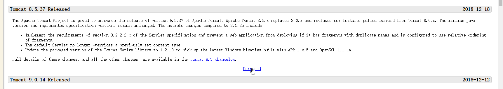

http://www.oracle.com/technetwork/java/javase/downloads/jdk8-downloads-2133151.html

https://download.oracle.com/otn-pub/java/jdk/8u191-b12/2787e4a523244c269598db4e85c51e0c/jdk-8u191-linux-x64.tar.gz?AuthParam=1546870506_6bb98c0783b03b2c4851433096cbaa22

tomcat 下载地址

http://mirrors.shu.edu.cn/apache/tomcat/tomcat-8/v8.5.37/bin/apache-tomcat-8.5.37.tar.gz

2、设置防火墙，执行 ufw allow 8989/tcp命令，允许防火墙放过8989端口。

3、 查看8989口段是否正常被监听netstat -an | grep 8989

通过curl http://7.104.137.378:8989,命令，查看在服务器上是否能直接访问tomcat

linux 查看并对外开放端口（防火墙拦截处理）
https://www.cnblogs.com/blog-yuesheng521/p/7198829.html

### 防火墙

解决CentOS7关闭/开启防火墙出现Unit iptables.service failed to load: No such file or directory.

https://blog.csdn.net/c233728461/article/details/52679558

CentOS7中执行
service iptables start/stop
会报错Failed to start iptables.service: Unit iptables.service failed to load: No such file or directory.

在CentOS 7或RHEL 7或Fedora中防火墙由firewalld来管理，

如果要添加范围例外端口 如 1000-2000
语法命令如下：启用区域端口和协议组合
firewall-cmd [--zone=<zone>] --add-port=<port>[-<port>]/<protocol> [--timeout=<seconds>]

添加
firewall-cmd --zone=public --add-port=80/tcp --permanent （--permanent永久生效，没有此参数重启后失效）

firewall-cmd --zone=public --add-port=1000-2000/tcp --permanent 

重新载入
firewall-cmd --reload
查看
firewall-cmd --zone=public --query-port=80/tcp
删除
firewall-cmd --zone=public --remove-port=80/tcp --permanent

### nginx 安装

https://www.cnblogs.com/jimisun/p/8057156.html

### node

wget https://npm.taobao.org/mirrors/node/v8.9.3/node-v8.9.3-linux-x64.tar.xz

                        ·xz -d node-v8.9.3-linux-x64.tar.xz  或者  tar -xzvf node-v8.9.3-linux-x64.tar.gz

                      ·tar -xvf node-v8.9.3-linux-x64.tar

[root@NKaRPU183123 /]# ln -s /usr/local/node/bin/node /usr/local/bin/node
[root@NKaRPU183123 /]# ln -s /usr/local/node/bin/npm /usr/local/bin/npm

#### git 全局变量
https://www.cnblogs.com/shelly01-zhou/p/7736610.html

我们要把编译安装的git路径放到环境变量里，让它替换"/usr/bin"下的git。为此我们可以修改“/etc/profile”文件（或者/etc/bashrc文件）。

vim /etc/profile

然后在文件的最后一行，添加下面的内容，然后保存退出。

export PATH=/usr/local/git/bin:$PATH
不想重启系统，使用source命令立即生效

source /etc/profile

tomcat 
http://103.40.19.241:8080/fm/

node dev
http://103.40.19.241:8001/

访问页面
http://103.40.19.241/#/login

FATAL ERROR: please install the following Perl modules before executing ./scripts/mysql_install_db:
Data::Dumper

解决方法是安装autoconf库

yum -y install autoconf 

安装完成之后继续执行安装mysql的命令：./scripts/mysql_install_db --user=mysql 

root@bigdata-159:/usr/local/mysql# ./bin/mysqld -- defaults-file=/etc/my.cnf --initialize --user=mysql
./bin/mysqld: error while loading shared libraries: libaio.so.1: cannot open shared object file: No such file or directory
 
解决方法：

[root@example.com data]# yum install -y libaio  //安装后在初始化就OK了