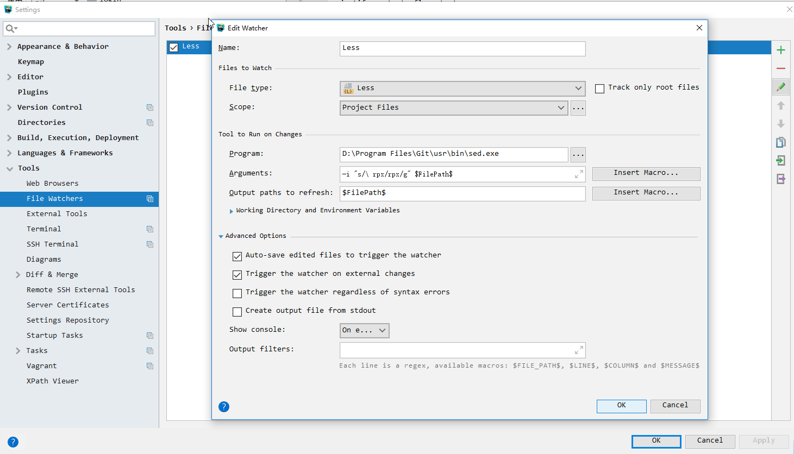

### WebStorm小程序开发，格式化样式文件时rpx前被添加空格的问题修复

使用WebStorm开发微信小程序，格式化样式文件时，带rpx的值格式化时总被空格分开，导致小程序样式错误

1. 解决方案：
    尝试修改WebStorm格式化代码的配置，查查之下，发现配置有限，未能解决 放弃
    通过FileWatcher动态修复 采纳
    
2. 解决步骤
    打开WebStorm配置，在Tools下找到File Watchers，自定义如下
    参数：-i "" s/"\ rpx"/rpx/g $FilePath$

### webstrom对wcss的支持

设置codestyle

### 古风歌曲
    寄明月
    风花雪月
    惊鸿一面
    我的一个道姑朋友
    山外小楼夜听雨

### 小程序

在控制台中可以输入以下命令

* build: 编译小程序
* preview: 预览
* upload: 上传代码
* openVendor: 打开基础库所在目录
* openToolsLog: 打开工具日志目录
* checkProxy(url): 检查指定 url 的代理使用情况
