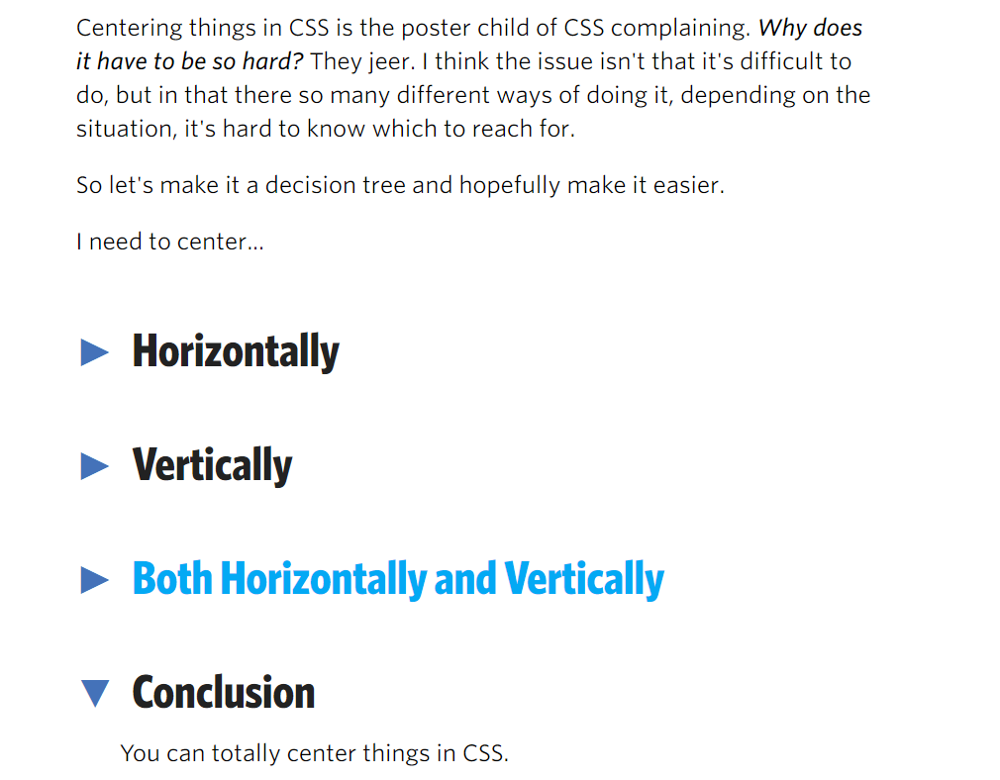

GitHub：为什么我们最终选择放弃了 jQuery 
https://blog.csdn.net/csdnnews/article/details/82783675

【半月刊 2】前端高频面试题及答案汇总
https://juejin.im/post/5c7bd72ef265da2de80f7f17

### VSC安转的插件
    code runner 运行一行js代码
    debugger for chrome  调试
    document this 注释
    eclipse keymap  改变快捷键
    jetBrains IDE keymap    改变快捷键设置

    indenticator 获焦当前块
    file peek 文件定位

    markdown all in one 
    numbered _bookmarks_    书签
    terminal    控制台
    
    vscode-icons

    settings sync
        'token': d001976f46c6ae000bf4bae7728038d8c5d29fe8
        "sync.gist": "7614bbc318624797989d7f58766dbfd8"

### 关于git的配置
    https://www.cnblogs.com/superGG1990/p/6844952.html
    设置用户名和邮箱
    $ git config --global user.name "superGG1990"
    $ git config --global user.email "superGG1990@163.com"
    ssh密钥
    $ ssh-keygen -t rsa -C "your_email@youremail.com"

### 居中问题
[居中问题](https://css-tricks.com/centering-css-complete-guide/)    

### less
https://www.cnblogs.com/waibo/p/7918454.html
http://www.runoob.com/manual/lessguide/usage/

绚丽的首页
http://www.flowpp.com/#page-1

Q：简单介绍下 React / Vue 的生命周期

A：几个钩子函数基本能报出来（如果不讲究按顺序、按挂载/更新区分、能把单词用英文念出来并且念对的话），稍微深入一点问下各个阶段都做了什么，一半以上就“不太清楚”了。更有甚者我问 React，对方回答 created、mounted，提醒之后还觉得自己没错的。

Q：【React】定义一个组件时候，如何决定要用 Functional 还是 Class？

A：简单的用 Functional，复杂的用 Class。（不能算错吧……但也不能算答到点子上）追问怎么界定“复杂”，答不上来。

Q：【React】HOC、（非）受控组件、shouldComponentUpdate、React 16 的变化

A：不清楚、没接触过。

Q：【Vue】介绍一下计算属性，和 data、methods、watch 的异同

A：基本都能巴拉一些，说的大部分都对，但就是说不到最关键的“当且仅当计算属性依赖的 data 改变时才会自动计算”。

Q：【Vue】为什么 SFC 里的 data 必须是一个函数返回的对象，而不能就只是一个对象？

A：我承认这个问题有点小难，有一定的区分度，不是每个人都有关注过，但是官方文档有说明这一点，但凡看过的肯定有印象。即便没完整看过文档，在初次学习的过程中难道就不觉得奇怪吗？“学而不思”的人和“学而思”的人，区别还是挺大的。

Q：CSS 选择器的权重

A：经典问题了吧？背都能背出来吧？伪类、伪元素分不清楚，只知道内联、!important、ID、Class 之间的顺序，加上其它的就懵了，而且只说谁大于谁，讲不出四位数的计算方法。单层选择器比较还行，几个叠加起来就迷糊了。

Q：JS 有哪几种原始类型

A：基础题，能说上来几个，答不全，主要问题集中在 null 和 undefined 没考虑进去、对象和数组算不算原始类型、以及 Symbol 很多人不知道。

Q：ES 2015+ 有哪些新特性

A：这题可以说的很多，根据应聘者的回答去展开，可以很容易地看出应聘者有没有系统地学习过这方面的东西，以及有没有持续地去跟进语言标准的发展。但这一题能回答的比较好的，寥寥无几，大部分是遇到问题然后零零散散现学的，不够全面、也不够深入，简单用过，但稍微问点细节就只有“尴尬而不失礼仪的微笑”了。

Q：工程化工具的使用（Webpack、ESLint、Yarn、Git）

A：基本都有所接触，但只是“用过”，算不上“会用”，一切顺利还好，真遇到问题了，立马就懵。

Q：Node.js

A：写过 Demo 的水平。

Q：未来 1~2 年的职业规划、下一步最想学的技术、最希望往什么方向发展、怎么看待XXX技术

* A：大部分人对自己没有一个明确的态度和规划。说白了就是还没从学校里出来，什么都等着别人来安排。