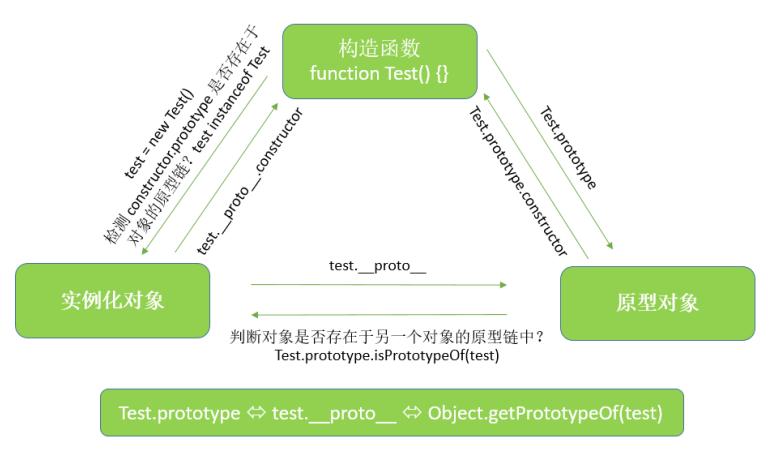
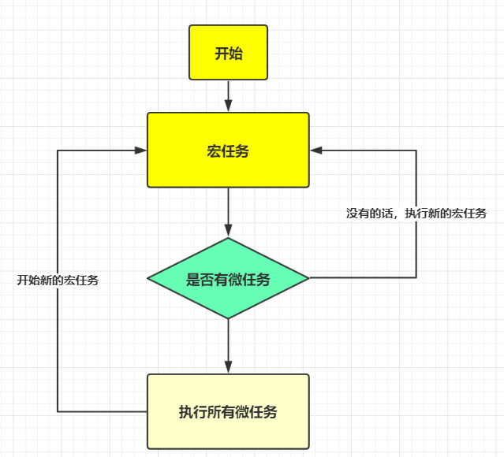

    

### wwww
    https://yuchengkai.cn
    前端进阶之道

    https://zhuanlan.zhihu.com/p/51607206
    一次凉凉的前端面试 

    https://juejin.im/post/5befeb5051882511a8527dbe
    一年半经验，百度、有赞、阿里前端面试总结 

    https://godbmw.com/passages/2018-11-28-try-web-interview/
    刷《一年半经验，百度、有赞、阿里面试总结》·手记

## JS基础相关
### this
	https://www.cnblogs.com/Nancy-wang/p/6928395.html
	1. 纯粹的函数调用 
		这是函数的最通常用法，属于全局性调用，因此this就代表全局对象Global。

	2. 作为对象方法的调用
		如果函数作为对象的方法调用，this指向的是这个上级对象，即调用方法的对象。 在以下代码中，this指向的是obj对象。
		function showName() {
			console.log(this.name);
		}
		var obj = {};
		obj.name = "ooo";
		obj.show = showName;
		obj.show(); //ooo

	3. 作为构造函数调用
		所谓构造函数，就是通过这个函数生成一个新对象（object）。这时，this就指这个新对象。

	4. call、apply调用
		apply和call都是为了改变函数体内部的this指向。
		apply()是函数对象的一个方法，它的作用是改变函数的调用对象，它的第一个参数就表示改变后的调用这个函数的对象。因此，this指的就是这第一个参数。


### demo with this
#### demo 1
	var story = {
		progress: "unknown",
		start: function() {
			this.progress = "start";
		}
	};
#### demo 2
	story.start();
	console.log(story.progress);//start
	console.log(progress)// error is not defined
	var story = {
		progress: "unknown",
		start: function () {
			this.progress = "start";
		}
	};
#### demo 3
	var start = story.start;
	start();
	console.log(story.progress);//unknown
	console.log(progress);//start
	var Story = function() {};
	Story.prototype = {
		progress: "unknown",
		start: function() {
			this.progress = "doing";
		}
	};


	console.log(Story.progress); // undefined

	var myStory = new Story();
	myStory.start();

	console.log(myStory.progress); // doing
	console.log(myStory.hasOwnProperty("progress")); //true
	console.log(myStory.hasOwnProperty("start")); //false

	原型中的this不是指的原型对象，而是调用对象;
	当myStory.start();执行后，myStory多了个值为"doing"的progress属性;
	执行的结果：this.progress = "doing"; → myStory.progress = "doing";

### js建立对象的方式
#### 工厂 
	工厂模式非常直观，将创建对象的过程抽象为一个函数，用函数封装以特定接口创建对象的细节。如下所示：
	function createStudent(name,sex,grade){                                                         
		var o = new Object();
		o.name = name;
		o.sex = sex;
		o.grade = grade;

		o.sayName = function(){
			console.log(this.name);
		}
		return o;
	}
	var s1 = createStudent('Claiyre','famale',1);
	通俗地讲，工厂模式就是将创建对象的语句放在一个函数里，通过传入参数来创建特定对象，最后返回创建的对象。
	工厂模式虽然可以创建多个相似的对象，但却不能解决对象标识的问题，即怎样知道一个对象的类型。构造函数模式应运而生。

#### 构造 
	构造函数模式的示例代码如下：
	function Student(name,sex,grade){                                                   
		this.name = name;
		this.sex = sex;
		this.grade = grade;
		this.sayName = function(){
			console.log(this.name);
		}
	}
	var s2 = new Student('孙悟空'，'male',2);

	与工厂模式相比，用构造模式创建对象有以下几点不同：
		没有显示地创建对象
		直接将属性和方法赋给this对象
		没有return语句

	此外，还应注意到要创建Student的实例，必须要使用new操作符，创建的实例对象将有一个constructor（构造器）属性，指向Person构造函数。
	调用构造函数创建对象经过了以下几个过程：
		创建一个新对象
		将构造函数的作用域赋给新对象（因此this就指向了这个新对象）
		执行构造函数中的代码
		返回新对象（不需要显式返回）

	构造函数虽好用，但也不是没有缺点。使用构造函数的主要问题是：每个方法都要在每个实例上创建一遍。在ECMAScript中，函数即对象，因此每定义一个函数，也就是实例化了一个对象。下面的例子证明了这个缺点。

	var s3 = new Student('唐僧','male',3);
	var s4 = new Student('白骨精','female',4);
	s3.sayName();
	s4.sayName();
	console.log(s3.sayName == s4.sayName);
	也就是说通过构造函数实例化的多个对象的方法，是多个不同的方法，但它们内部的代码以及实现的功能是相同的，这就造成了一定的资源浪费。
	幸运的是，这个问题可以用原型模式来解决。

#### 原型
	js中，每个函数都有一个prototype属性，它是一个指针，指向一个对象，叫做原型对象，原型对象包含了可以由特定类型的所有实例对象共享的属性和方法。此外，这个对象有一个与生自来的属性constructor，指向创建对象的构造方法。
	使用原型模式可以让所有的实例共享原型对象中的属性和方法，也就是说，不必再构造函数中定义对象实例的信息。用代码表示如下：

	function Student_1(){

	}
	Student_1.prototype.name = 'Claiyre';
	Student_1.prototype.sex = 'female';
	Student_1.prototype.class = 5;
	Student_1.prototype.sayName = function (){
		console.log(this.name);
	}

	var s5 = new Student_1();                                                         
	s5.sayName();    //Claiyre
	var s6 = new Student_1();
	s6.sayName();    //Claiyre

	了解过原型后，可以继续在实例对象上增添属性或方法：
	s6.name = 'John';                                                     
	s6.sayName();       //John
	当要读取某个对象的属性时，都会执行一次搜索，搜索首先从对象实例本身开始，如果在实例中找到了这个属性，则搜索结束，返回实例属性的值；若实例上没有找到，则继续向对象的原型对象延伸，搜索对象的原型对象，若在原型对象上找到了，则返回原型上相应属性的值，若没有找到，则返回undefined。因此，实例对象属性会覆盖原型对象上的同名属性，所以上面第二行代码输出的是John。

	Object.getPrototypeOf(object)方法返回参数对象的原型对象。
	Object.keys(object)方法返回对象上课枚举的实例属性。
	原型中的所有属性都是被所有实例所共享的，这种共享对于函数来说非常合适，对于包含基本值的属性也说的过去（实例属性会覆盖原型同名属性），但对于那些包含引用类型的属性，可有大麻烦了
	Student_1.prototype.friends = ['aa','bb'];
	console.log('s6的朋友' + s6.friends);
	s5.friends.push('cc');
	console.log('s5的朋友' + s5.friends);
	console.log('s6的朋友' + s6.friends);
	问题来了，我们只想改变s5的朋友列表，但由于原型模式的共享本质，s6的朋友列表也随之改变了。
	因此，很少单独使用原型模式。	

#### 组合使用构造函数和原型模式
	构造函数模式用于定义实例属性，原型模式则用于定义方法和共享的属性。这种混合模式不仅支持向构造函数传入参数，还最大限度地节约了内存，可谓是集两模式之长。示例代码如下：
	function Student(name,sex,grade){                                                   
		this.name = name;
		this.sex = sex;
		this.grade = grade;
	}
	Student.prototype.sayName = function(){
			console.log(this.name);
	}
	Student.prototype.school = 'Joooh school';

### js继承方式及其优缺点
	原型链继承的缺点
		一是字面量重写原型会中断关系，使用引用类型的原型，并且子类型还无法给超类型传递参数。
	借用构造函数（类式继承）
		借用构造函数虽然解决了刚才两种问题，但没有原型，则复用无从谈起。所以我们需要原型链+借用构造函数的模式，这种模式称为组合继承
	组合式继承
		组合式继承是比较常用的一种继承方法，其背后的思路是 使用原型链实现对原型属性和方法的继承，而通过借用构造函数来实现对实例属性的继承。这样，既通过在原型上定义方法实现了函数复用，又保证每个实例都有它自己的属性。

	具体请看：JavaScript继承方式详解:
	https://segmentfault.com/a/1190000002440502
	
	可以通过两种方式来确定原型和实例之间的关系。操作符instanceof和isPrototypeof()方法


### 用过哪些设计模式
#### 工厂模式
	主要好处就是可以消除对象间的耦合，通过使用工程方法而不是new关键字。
	将所有实例化的代码集中在一个位置防止代码重复。
	工厂模式解决了重复实例化的问题 ，但还有一个问题,那就是识别问题，因为根本无法 搞清楚他们到底是哪个对象的实例。

```js
function createObject(name,age,profession){//集中实例化的函数
	var obj = new Object();
	obj.name = name;
	obj.age = age;
	obj.profession = profession;
	obj.move = function () {
		return this.name + ' at ' + this.age + ' engaged in ' + this.profession;
	};
	return obj;
}
var test1 = createObject('trigkit4',22,'programmer');//第一个实例
var test2 = createObject('mike',25,'engineer');//第二个实例
```	

#### 构造函数模式
	使用构造函数的方法 ，即解决了重复实例化的问题 ，又解决了对象识别的问题，该模式与工厂模式的不同之处在于：
	1.构造函数方法没有显示的创建对象 (new Object());
	2.直接将属性和方法赋值给 this 对象;
	3.没有 renturn 语句。

### null和undefined的区别？
	null是一个表示"无"的对象，转为数值时为0；undefined是一个表示"无"的原始值，转为数值时为NaN。
	当声明的变量还未被初始化时，变量的默认值为undefined。
	null用来表示尚未存在的对象，常用来表示函数企图返回一个不存在的对象。

	null表示"没有对象"，即该处不应该有值。典型用法是：
	（1） 作为函数的参数，表示该函数的参数不是对象。
	（2） 作为对象原型链的终点。

	undefined表示"缺少值"，就是此处应该有一个值，但是还没有定义。典型用法是：
	（1）变量被声明了，但没有赋值时，就等于undefined。
	（2) 调用函数时，应该提供的参数没有提供，该参数等于undefined。
	（3）对象没有赋值的属性，该属性的值为undefined。
	（4）函数没有返回值时，默认返回undefined。


### new操作符具体干了什么
    https://juejin.im/post/5bde7c926fb9a049f66b8b52
	（1）新建一个对象	let instance=new Object();
	（2）设置原型链	instance.__proto__=F.prototype;  
	（3）将构造函数this指向instance，并执行构造函数，为新对象添加属性
	（4）判断F的返回值类型：如果是值类型，就丢弃它，还是返回instance。如果是引用类型，就返回这个引用类型的对象，替换掉instance。

	注：
	（1）如果没有写return，相当于return undefined，JavaScript中的函数都是这样。undefined是值类型的，因此丢弃它，返回instance。
	（2）如果return this相当于返回一个引用类型的对象，它自己就是instance，无所谓替换不替换了。
	（3）对instance并不需要设置它的constructor属性，这个属性在instance的原型中。
	console.assert(!p.hasOwnProperty('constructor'));
	console.assert(F.prototype.hasOwnProperty('constructor'));
	而且，任意一个新函数在创建时，原型的constructor就已经设置好了。
	var G=function(){};
	console.assert(G.prototype.hasOwnProperty('constructor'));
	console.assert(G.prototype.constructor===G);
	于是，这也要求我们在对prototype重新赋值的时候，重新指定constructor属性。F.prototype={ constructor:F };

    以 var child = new Parent()为例：
    function newParent(){
        var obj = {}; // 首先创建一个对象
        obj.__proto__ = Parent.prototype; // 然后将该对象的__proto__属性指向构造函数的protoType
        var result = Parent.call(obj) // 执行构造函数的方法，将obj作为this传入
        return typeof(result) == 'object' ?  result : obj
    }

### 原型链关系
```js
function A() {}
var a = new A();
a.__proto__ ===  A.prototype 
Object.getPrototypeOf(a) === A.prototype 

console.log(a.constructor == A); //true  (A.prototype == a.constructor.prototype); //true
console.log(a.constructor == A.prototype.constructor); //true
```



1. 原型对象是构造函数的prototype属性，是所有实例化对象共享属性和方法的原型对象。
2. 实例化对象通过new构造函数得到，都继承了原型对象的属性和方法。
3. 原型对象中有个隐式的constructor，指向了构造函数本身。

### js中数据类型
JavaScript中的数据很简洁的:
* 简单数据只有 undefined, null, boolean, number和string这五种
* 复杂数据只有一种，即object
* 代码只体现为一种形式，即function

JavaScript的标识、常量、变量和参数都只是unfined, null, boolean, number, string, object 和 function类型中的一种，也就typeof返回值表明的类型

1. 简单的数据类型
* undefined	代表一切未知的事物，啥都没有，无法想象，代码也就更无法去处理了。注意：typeof(undefined) 返回也是 undefined。 可以将undefined赋值给任何变量或属性，但并不意味了清除了该变量，反而会因此多了一个属性。
* null	有那么一个概念，但没有东西。无中似有，有中还无。虽难以想象，但已经可以用代码来处理了。 注意：typeof(null)返回object，但null并非object，具有null值的变量也并非object。
* boolean	是就是，非就非，没有疑义。对就对，错就错，绝对明确。既能被代码处理，也可以控制代码的流程。
* number	线性的事物，大小和次序分明，多而不乱。便于代码进行批量处理，也控制代码的迭代和循环等。 注意：typeof(NaN)和typeof(Infinity)都返回number 。 NaN参与任何数值计算的结构都是NaN，而且 NaN != NaN 。 Infinity / Infinity = NaN 。
* string	面向人类的理性事物，而不是机器信号。人机信息沟通，代码据此理解人的意图等等，都靠它了。

2. 对象数据类型
* 简单类型都不是对象，直接被赋予简单类型常量值的标识符、变量和参数都不是一个对象。
* 所谓“对象化”，就是可以将数据和代码组织成复杂结构的能力。JavaScript中只有object类型和function类型提供了对象化的能力。
* 大多数情况下，我们也没有必要去纠缠这些细节问题。只要你记住一点：JavaScript里的代码也是一种数据，同样可以被任意赋值和修改的，而它的值就是代码的逻辑。只是，与一般数据不同的是，函数是可以被调用执行的。
* 不过，如果JavaScript函数仅仅只有这点道行的话，这与C++的函数指针，DELPHI的方法指针，C#的委托相比，又有啥稀奇嘛！然而，JavaScript函数的神奇之处还体现在另外两个方面：一是函数function类型本身也具有对象化的能力，二是函数function与对象 object超然的结合能力。
* 对象化：任何一个函数都可以为其动态地添加或去除属性，这些属性可以是简单类型，可以是对象，也可以是其他函数。也就是说，函数具有对象的全部特征，你完全可以把函数当对象来用。其实，函数就是对象，只不过比一般的对象多了一个括号“()”操作符，这个操作符用来执行函数的逻辑。即，函数本身还可以被调用，一般对象却不可以被调用，除此之外完全相同。

### js string
```js
var str = "tesst, Tes, tst, tset, Test, Tesyt, sTes";
var reg = /ess/;

reg.test(str) //true
reg.exec(str) //[ig'zek] [ 'es',  index: 7,  input: 'test, Tes, tst, tset, Test, Tesyt, sTes' ]

str.search(reg) // 1
str.match(reg) // [ 'es', 'es', 'es', 'es', 'es' ]

str.indexOf("es") //1   //不接受正则作为参数
str.lastIndexOf("es") //38

'aaaa'.replace(/\w/g, (value) => value.toUpperCase()); 

'12345432'.replace(/(?=(?!\b)(\d{3})+$)/g, ',') // "12,345,432"  (?=) 前向声明  (?!) 反前向声明

new RegExp( "\\s|^" + name + "\\s|$" )  // 字符串检测 存在某个str
```

### js array
	es3：
		pop shift  删除(被删除的值)   push unshift  添加(新数组的长度)	order	reverse
		
		Array.prototype.concat()返回一个新数组，不会改变原数组，但是会占用较多内存。
		Array.prototype.push()会改变this数组，返回最新length属性，占用内存较少。
		splice() 方法向/从数组中添加/删除项目，然后返回被删除的项目。
			注释：该方法会改变原始数组。
			语法：arrayObject.splice(index,howmany,item1,.....,itemX)
			参数：
				index	必需。整数，规定添加/删除项目的位置，使用负数可从数组结尾处规定位置。
				howmany	必需。要删除的项目数量。如果设置为 0，则不会删除项目。
				item1, ..., itemX	可选。向数组添加的新项目。
	es5:
		2个索引方法：indexOf() 和 lastIndexOf()
		5个迭代方法：forEach()、map()、filter()、some()、every()
		2个归并方法：reduce()、reduceRight()
	es6:
		Array.from Array.of 
		.fill .find .findIndex .includes
		.key .value .entries
		.copyWithin
	数组去重：
		const arr = [...new Set([1, 2, 3, 3, NaN, NaN])]// [1, 2, 3, NaN]   

## 跨域
### jsonp
    利用 <script> 标签没有跨域限制的漏洞。通过 <script> 标签指向一个需要访问的地址并提供一个回调函数来接收数据当需要通讯时。
    get请求
### CORS（跨域资款共享）
    实现CORS的响应头信息Access-Control-Allow-Origin。

    CORS（跨域资源共享 Cross-origin resource sharing）允许浏览器向跨域服务器发出XMLHttpRequest请求，从而克服跨域问题，它需要浏览器和服务器的同时支持。
        浏览器端会自动向请求头添加origin字段，表明当前请求来源。
        服务器端需要设置响应头的Access-Control-Allow-Methods，Access-Control-Allow-Headers，Access-Control-Allow-Origin等字段，指定允许的方法，头部，源等信息。
        请求分为简单请求和非简单请求，非简单请求会先进行一次OPTION方法进行预检，看是否允许当前跨域请求。

    后端的响应头信息：
        Access-Control-Allow-Origin：该字段是必须的。它的值要么是请求时Origin字段的值，要么是一个*，表示接受任意域名的请求。
        Access-Control-Allow-Credentials：该字段可选。它的值是一个布尔值，表示是否允许发送Cookie。
        Access-Control-Expose-Headers：该字段可选。CORS请求时，XMLHttpRequest对象的getResponseHeader()方法只能拿到6个基本字段：Cache-Control、Content-Language、Content-Type、Expires、Last-Modified、Pragma。如果想拿到其他字段，就必须在Access-Control-Expose-Headers里面指定。

    其他跨域解决方案
        Nginx反向代理
        postMessage
        document.domain
### document.domain
    该方式只能用于二级域名相同的情况下，比如 a.test.com 和 b.test.com 适用于该方式。
    只需要给页面添加 document.domain = 'test.com' 表示二级域名都相同就可以实现跨域
    
## 模块化规范
### CommonJS模块规范
	Node应用由模块组成，采用CommonJS模块规范。
	根据这个规范，每个文件就是一个模块，有自己的作用域。在一个文件里面定义的变量、函数、类，都是私有的，对其他文件不可见。
	CommonJS规范规定，每个模块内部，module变量代表当前模块。这个变量是一个对象，它的exports属性（即module.exports）是对外的接口。加载某个模块，其实是加载该模块的module.exports属性。
		var x = 5;
		var addX = function (value) {
			return value + x;
		};
		module.exports.x = x;
		module.exports.addX = addX;

	上面代码通过module.exports输出变量x和函数addX。

	require方法用于加载模块:
		var example = require('./example.js');
		console.log(example.x); // 5
		console.log(example.addX(1)); // 6

### ES6模块规范
不同于CommonJS，ES6使用 export 和 import 来导出、导入模块。

1. 简单的使用

```js
function outputA(){ console.log("this is output A"); }
function outputB(){ console.log("this is output B"); }
export {outputA,outputB} // 方式1 
export {outputA as alias,outputB} // 方式2


//  1
import {outputA,outputB} from "./export.js"
outputA()

//  2
import * as alias from "./export.js"
```

2. export default
* 在引入文件中，如果需要使用export.js中的函数，用户必须先知道它的名字，如果用户不想翻文档或者怎么滴，这样子就不太方便，所以就有了
```js
function outputA(){ console.log("this is output A"); }
export default outputB;

import alias from "./export.js"
alias();
```

3. 综合应用
```js
function outputA(){ console.log("this is output A"); }
function outputB(){ console.log("this is output B"); }
export {outputA as alias,outputB}
export default outputB; 

import * as x from "./export.js"
console.log(x);
// {alias:[getter],outputB:[getter],default:[Function:outputB]} 
// export default的本质是输出一个叫做default的方法，系统允许我们对它取任意名称
// 也就是说，如果import时变量只有一个，而且外面没有{}，那么该变量接受的就是export default。
// 如果import时变量放在{}里，那么就会拿到对应的export。
// 我们可以用这种方式同时接受export与export default
import x,{alias,outputB} from "./export.js"
```

import命令会被 JavaScript 引擎静态分析，无法实现require("a"+"b")的动态加载功能，有个提案：import()函数
* import()类似于 Node 的require方法，区别主要是前者是异步加载，后者是同步加载。
* import()可以在需要的时候，再加载某个模块。

相关链接：
* CommonJS规范，http://javascript.ruanyifeng.com/nodejs/module.html
* ES6 Module 的语法，http://es6.ruanyifeng.com/#docs/module

### es6模块与 commonJS规范的区别
	commomJS模块：
		1、获得的是缓存值，是对模块的拷贝
		2、可以对commomJS模块重新赋值
		3、可以对对象内部的值进行改变

	es6模块：
		1、获得的是实时值，是对模块的引用
		2、对es6模块重新赋值会报错
		3、可以对对象内部的值进行改变
	
	commonJS 
	　　module.exports =  ...   :      '只能输出一个，且后面的会覆盖上面的'
	　　exports. ...  : ' 可以输出多个'，
	　　运行阶段确定接口，运行时才会加载模块，
	　　模块是对象，加载的是该对象，
	　　加载的是整个模块，即将所有的接口全部加载进来，
	　　输出是值的拷贝，即原来模块中的值改变不会影响已经加载的该值，
	　　this 指向当前模块

	es6 
	　　export   :      '可以输出多个，输出方式为 {}' ，
	　　export  default : ' 只能输出一个 ，可以与export 同时输出，但是不建议这么做'，
	　　解析阶段确定对外输出的接口，解析阶段生成接口，
	　　模块不是对象，加载的不是对象，
	　　可以单独加载其中的某个接口（方法），
	　　静态分析，动态引用，输出的是值的引用，值改变，引用也改变，即原来模块中的值改变则该加载的值也改变，
	　　this 指向undefined

    CommonJS 模块输出的是一个值的拷贝，ES6 模块输出的是值的引用
        CommonJS 模块输出的是值的拷贝，也就是说，一旦输出一个值，模块内部的变化就影响不到这个值。
        ES6 Modules 的运行机制与 CommonJS 不一样。JS 引擎对脚本静态分析的时候，遇到模块加载命令import，就会生成一个只读引用。等到脚本真正执行时，再根据这个只读引用，到被加载的那个模块里面去取值。换句话说，ES6 的 import 有点像 Unix 系统的“符号连接”，原始值变了，import加载的值也会跟着变。因此，ES6 模块是动态引用，并且不会缓存值，模块里面的变量绑定其所在的模块。
    CommonJS 模块是运行时加载，ES6 模块是编译时输出接口。
        运行时加载: CommonJS 模块就是对象；即在输入时是先加载整个模块，生成一个对象，然后再从这个对象上面读取方法，这种加载称为“运行时加载”。
        编译时加载: ES6 模块不是对象，而是通过 export 命令显式指定输出的代码，import时采用静态命令的形式。即在import时可以指定加载某个输出值，而不是加载整个模块，这种加载称为“编译时加载”
        CommonJS 加载的是一个对象（即module.exports属性），该对象只有在脚本运行完才会生成。而 ES6 模块不是对象，它的对外接口只是一种静态定义，在代码静态解析阶段就会生成。

### module.exports exports || export export default
	exports与module.exports还有import
	https://blog.csdn.net/wopelo/article/details/78890566
	https://www.jianshu.com/p/f6c5a646c00b

	es5中用module.exports和exports导出模块，用require引入模块
		module.exports和exports一开始都是一个空对象{}，实际上，这两个对象指向同一块内存
		这也就是说module.exports和exports是等价的
		有个前提：不去改变它们指向的内存地址

			为了方便，Node为每个模块提供一个exports变量，指向module.exports。这等同在每个模块头部，有一行这样的命令。
			var exports = module.exports;
			于是我们可以直接在 exports 对象上添加方法，表示对外输出的接口，如同在module.exports上添加一样。
			注意，不能直接将exports变量指向一个值，因为这样等于切断了exports与module.exports的联系。

            真正输出总是 module.exports。如果两者同时出现或被修改，只有 module.exports 返回，exports 被忽略。
            https://cnodejs.org/topic/54e67b70629934692ea99f91

		exports.age = 18 和 module.export.age = 18，这两种写法是一致的(都相当于给最初的空对象{}添加了一个属性)
		require() 返回的是 module.exports 而不是 exports，exports只不过是指向的 module.exports 的引用

	es6新增export和export default导出模块，import导入模块。


## 其他
### 说说你对Promise的理解
	依照 Promise/A+ 的定义，Promise 有四种状态：
		pending: 初始状态, 非 fulfilled 或 rejected.
		fulfilled: 成功的操作.
		rejected: 失败的操作.

		settled: Promise已被fulfilled或rejected，且不是pending
		另外， fulfilled 与 rejected 一起合称 settled。

	Promise 对象用来进行延迟(deferred) 和 异步(asynchronous)计算。

	通过构造函数构造一个 Promise，最基本的用法如下：
		var promise = new Promise(function(resolve, reject) {
			if (...) {  // succeed
				resolve(result);
			} else {   // fails
				reject(Error(errMessage));
			}
		});

	Promise 实例拥有 then 方法（具有 then 方法的对象，通常被称为 thenable）。 它的使用方法如下：
		promise.then(onFulfilled, onRejected)
		接收两个函数作为参数，一个在 fulfilled 的时候被调用，一个在 rejected 的时候被调用，接收参数就是 future，onFulfilled 对应 resolve, onRejected 对应 reject。


### event loop
    https://segmentfault.com/a/1190000016278115
    event loop是一个执行模型，在不同的地方有不同的实现。浏览器和NodeJS基于不同的技术实现了各自的Event Loop。
        浏览器的Event Loop是在html5的规范中明确定义。
        NodeJS的Event Loop是基于libuv实现的。可以参考Node的官方文档以及libuv的官方文档。
        libuv已经对Event Loop做出了实现，而HTML5规范中只是定义了浏览器中Event Loop的模型，具体的实现留给了浏览器厂商。
#### 浏览器
    宏队列(script > setTimeout > setImmediate ...)和微队列(process.nextTick > Promise)
        调用栈Stack
        微队列
        宏队列
    1. 调用栈Stack执行结束
    2. 微队列先进先出执行,循环执行,新生成的继续添加到队尾并执行完
    3. 宏队列首个执行完
    [232323]

#### node (libuv)
    4个宏队列 Timers  IO   ...
    2个微队列 process.nextTick() and Promise

### TCP的三次握手和四次挥手
    #三次握手
    第一次握手： 客户端发送一个SYN码给服务器，要求建立数据连接；
    第二次握手： 服务器收到SYN同时自己也发送一个SYN包（标志）；叫SYN+ACK（确认包）；发送给客户端，可以建立连接
    第三次握手： 客户端再次发送ACK向服务器，服务器验证ACK没有问题，则建立起连接；

    #四次挥手
    第一次挥手： 客户端发送FIN(释放报文)报文，通知服务器数据已经传输完毕；
    第二次挥手: 服务器接收到之后，通知客户端我收到了FIN,发送ACK(确认)给客户端，此时服务器处于关闭等待状态,但是服务器再次发送数据，客户端仍然接受得到。
    第三次挥手： 服务器已经传输完毕，再次发送FIN(释放报文)通知客户端，数据已经传输完毕
    第四次挥手： 客户端接收到服务器的释放报文后,需要发送ACK确认报文,进入TIME_WAIT状态；服务器和客户端关闭连接

### 节流 防抖
    节流: 触发函数事件后，短时间 间隔内无法连续调用，只有上一次函数执行完后，过了规定的时间 间隔，才能进行下一次的函数调用，一般用于http请求。
    防抖：函数防抖一般是指对于在事件被触发n秒后再执行的回调，如果在这n秒内又重新被触发，则重新开始计时。

### webpack总结
	https://segmentfault.com/a/1190000011042867
	GitChat · 前端 | webpack 从入门到工程实践
	
	入口 entry
	出口 output [path name chunkFilename publicPath]
	转义 loader 
		转换编译：script-loader/babel-loader/ts-loader/coffee-loader等。
		处理样式：style-loader/css-loader/less-loader/sass-loader/postcss-loader等。
		处理文件：raw-loader/url-loader/file-loader/等。
		处理数据：csv-loader/xml-loader等。
		处理模板语言：html-loader/pug-loader/jade-loader/markdown-loader等。
		清理和测试：mocha-loader/eslint-loader等。
	插件plugins
		plugins功能众多，但是大多数plugin的功能主要集中在两方面：
		1. 对前一阶段打包后的代码进行处理，如添加替换一些内容，分割代码为多块，添加一些全局设置等。
		2. 辅助输出，如自动生成带有链接的index.html，对生成文件存储文件夹做一定的清理等。

		BannerPlugin
		CommonsChunkPlugin 用于抽离代码： 抽离不同文件的共享代码 抽离第三方模块 共用代码抽离 Manifest可抽离解决缓存问题
		CompressionWebpackPlugin 使用配置的算法（如gzip）压缩打包生成的文件
		DefinePlugin 定义全局
		EnvironmentPlugin
		ExtractTextWebpackPlugin 抽离css
		ProvidePlugin 自动加载，无需每次使用都引用
		UglifyjsWebpackPlugin 压缩代码

		HtmlWebpackPlugin 生成html
		CleanWebpackPlugin 清空

### jwt 跨域身份验证
    https://baijiahao.baidu.com/s?id=1608021814182894637&wfr=spider&for=pc

    JSON Web Token（JWT）是目前最流行的跨域身份验证解决方案。
    通过客户端保存数据，而服务器根本不保存会话数据，每个请求都被发送回服务器。 JWT是这种解决方案的代表。

    使用方式:
        客户端接收服务器返回的JWT，将其存储在Cookie或localStorage中。 此后，客户端将在与服务器交互中都会带JWT。
            如果将它存储在Cookie中，就可以自动发送，但是不会跨域;
            因此一般是将它放入HTTP请求的Header Authorization字段中;

    JWT的数据结构
        JWT头 有效载荷 签名

    JWT问题和趋势
        1、JWT默认不加密，但可以加密。生成原始令牌后，可以使用改令牌再次对其进行加密。
        2、当JWT未加密方法时，一些私密数据无法通过JWT传输。
        3、JWT不仅可用于认证，还可用于信息交换。善用JWT有助于减少服务器请求数据库的次数。
        4、JWT的最大缺点是服务器不保存会话状态，所以在使用期间不可能取消令牌或更改令牌的权限。也就是说，一旦JWT签发，在有效期内将会一直有效。
        5、JWT本身包含认证信息，因此一旦信息泄露，任何人都可以获得令牌的所有权限。为了减少盗用，JWT的有效期不宜设置太长。对于某些重要操作，用户在使用时应该每次都进行进行身份验证。
        6、为了减少盗用和窃取，JWT不建议使用HTTP协议来传输代码，而是使用加密的HTTPS协议进行传输。

### $nextTick
    https://github.com/ziyi2/ziyi2.github.io/issues/5
    https://www.cnblogs.com/liuhao-web/p/8919623.html
    https://github.com/answershuto/learnVue/blob/master/docs/Vue.js异步更新DOM策略及nextTick.MarkDown

    尽管MVVM框架并不推荐访问DOM，但有时候确实会有这样的需求，尤其是和第三方插件进行配合的时候，免不了要进行DOM操作。而nextTick就提供了一个桥梁，确保我们操作的是更新后的DOM。
    那么问题来了，vue如何检测到DOM更新完毕呢？
    能监听到DOM改动的API好像只有MutationObserver了，用于监听DOM修改事件，能够监听到节点的属性、文本内容、子节点等的改动

        var observer = new MutationObserver(function(){ console.log('DOM被修改了！'); });
        var article = document.querySelector('article');
        observer.observer(article);

    创建一个文本节点，监听这个文本节点的改动事件，以此来触发nextTickHandler（也就是DOM更新完毕回调）的执行。后面的代码中，会执行手工修改文本节点属性，这样就能进入到回调函数了

    实际上并不是这样：
        在js的运行环境中，通常伴随着很多事件的发生，比如用户点击、页面渲染、脚本执行、网络请求，等等。为了协调这些事件的处理，浏览器使用事件循环机制。

        我们平时用setTimeout来执行异步代码，其实就是在任务队列的末尾加入了一个task，待前面的任务都执行完后再执行它。

        关键的地方来了，每次event loop的最后，会有一个UI render步骤，也就是更新DOM。标准为什么这样设计呢？
        
        考虑下面的代码：
        for(let i=0; i<100; i++){ dom.style.left = i + 'px'; }
        浏览器会进行100次DOM更新吗？显然不是的，这样太耗性能了。事实上，这100次for循环同属一个task，浏览器只在该task执行完后进行一次DOM更新。

    那我们的思路就来了：只要让nextTick里的代码放在UI render步骤后面执行，岂不就能访问到更新后的DOM了？
    vue就是这样的思路，并不是用MO进行DOM变动监听，而是用队列控制的方式达到目的。那么vue又是如何做到队列控制的呢？我们可以很自然的想到setTimeout，把nextTick要执行的代码当作下一个task放入队列末尾。

    常见的microtask有：Promise、MutationObserver、Object.observe(废弃)，以及nodejs中的process.nextTick.


### 虚拟dom
    https://juejin.im/post/5c8e5e4951882545c109ae9c
    我们来梳理一下整个DOM-diff的过程：
    1. 用JS对象模拟DOM（虚拟DOM）
    2. 把此虚拟DOM转成真实DOM并插入页面中（render）
    3. 如果有事件发生修改了虚拟DOM，比较两棵虚拟DOM树的差异，得到差异对象（diff）
    4. 把差异对象应用到真正的DOM树上（patch）


### webpack插件
1. 符合什么样的条件能作为 webpack 插件呢？一般来说，webpack 插件有以下特点：
* 独立的 JS 模块,暴露相应的函数, 函数原型上的 apply 方法会注入 compiler 对象
* compiler 对象上挂载了相应的 webpack 事件钩子 
* compiler 有 compiler.plugin函数。这个相当于是插件可以进行处理的webpack的运行中的一些任务点，webpack就是完成一个又一个任务而完成整个打包构建过程的。
    任务开始 -> compile -> after-compile -> emit -> after-emit
* 事件钩子的回调函数里能拿到编译后的 compilation 对象，如果是异步钩子还能拿到相应的 callback

```js
class BasicPlugin{
  // 在构造函数中获取用户给该插件传入的配置
  constructor(options){
  }
  // Webpack 会调用 BasicPlugin 实例的 apply 方法给插件实例传入 compiler 对象
  apply(compiler){
    const onEmit = (compilation, callback) => {
      callback()
    }
    // 检测是否是webpack4
    if (compiler.hooks) { // 注册emit事件的监听函数 webpack4
      compiler.hooks.emit.tapAsync(this.constructor.name, onEmit)
    } else { // 注册emit事件的监听函数 webpack3及之前
      compiler.plugin('emit', onEmit)
    }
  }
}
// 导出 Plugin
module.exports = BasicPlugin;
```

### babel
    plugins和presets编译，也许会有相同的功能，或者有联系的功能
    plugins优先于presets进行编译,plugins正序进行编译,presets逆序进行编译

    polyfill | runtime
        polyfill    Babel 默认只转换新的 JavaScript 语法，而不转换新的 API。例如新的对象以及对象上的方法
        runtime     使用公共模块,不会污染全局环境 非实例方法的poly-fill

### babel7
    升级相关
        1. 使用scope package的写法,加上@babel 命名空间
        2. es2015 插件 -> env 插件 ( @babel/preset-env 囊括了所有 yearly presets 的功能 )
        3. stage -> proposal 
        4. 升级工具 babel-upgrade


    "plugins": ["@babel/proposal-class-properties"]
        如果不用箭头函数，我们就需要使用bind将函数一个个绑定好
        如果使用箭头函数,箭头函数被当作成class的属性来看待,this会指向undefined
        添加babel-plugin-transform-class-properties来转译即可

        class Bork {
            boundFunction = () => {
                return this.state;
            }
        }

### 控制viewport
	<meta name="viewport" content="width=device-width,inital-scale=1.0,maximum-scale=1.0,minimum-scale=1.0,user-scalable=no">

### eslint 
    配置示例
        extends:'standard'
        plugins:['html']
        rules:{'arrow-parens':0,'generate-star-spacing':0,'no-debugger':process.env.NODE_EVN=='production'?2:0}
        semi:["error","always"]
        indent:0

    eslint-disable
        在js里面，new 一个对象，需要赋值给某个值（变量），用Vue实例化的时候，不需要赋值给值（变量），所以要单独给配一条规则，给new Vue这行代码上面加这个注释，把这行代码规则的校验跳过，通过eslint-disable。
        /* eslint-disable no-new */
        https://www.cnblogs.com/hahazexia/p/6393212.html
		
### cancas和SVG的是什么以及区别
	SVG 是一种使用 XML 描述 2D 图形的语言。SVG 基于 XML，这意味着 SVG DOM 中的每个元素都是可用的。您可以为某个元素附加 JavaScript 事件处理器。在 SVG 中，每个被绘制的图形均被视为对象。如果 SVG 对象的属性发生变化，那么浏览器能够自动重现图形。
	Canvas 通过 JavaScript 来绘制 2D 图形。Canvas 是逐像素进行渲染的。在 canvas 中，一旦图形被绘制完成，它就不会继续得到浏览器的关注。如果其位置发生变化，那么整个场景也需要重新绘制，包括任何或许已被图形覆盖的对象。

### Canvas 与 SVG 的比较
	Canvas
		依赖分辨率
		不支持事件处理器
		弱的文本渲染能力
		能够以 .png 或 .jpg 格式保存结果图像
		最适合图像密集型的游戏，其中的许多对象会被频繁重绘
	SVG
		不依赖分辨率
		支持事件处理器
		最适合带有大型渲染区域的应用程序（比如谷歌地图）
		复杂度高会减慢渲染速度（任何过度使用 DOM 的应用都不快）
		不适合游戏应用

    svg及内部元素获取
        let oSvg=document.createElement("svg");
        let line=docuemnt.createElementNS("");
	
### 快速过一遍canvas的API。
	//demo.html
	<canvas id='canvas' width='500' height='500'></canvas> 
	[注]
	设置canvas的宽高要在元素或在其API，canvas.width || canvas.height，在CSS上设置为得到意想不到的结果，不信试试看哈···

	//demo.js
	var canvas = document.getElementById('canvas');
	var context = canvas.getContext('2d');

	//路径或图形
	context.fillRect();//填充矩形
	context.strokeRect();//勾勒矩形轮廓
	context.arc(x,y,r,anglestart,angleend,clockwise);//画弧形

	context.beginPath();//开始路径
	context.moveTo();//定义路径起始点
	context.lineTo();//路径的去向
	context.closePath();//画完后，关闭路径
	context.fill() || context.stroke();//最后画出由路径构成的图形
	[注]
	本质上，所有的多边形都可以由路径画出；

	context.save();//保存save以上context对象设置的属性值
	context.restore();//恢复到先前保存在context对象上的所有属性值
	
	
	window.requestAnimationFrame这个API你可以理解为window.setTimeout(callback,time)

	事实上，当部分浏览器不兼容这个API时，我们也可以写成以下形式：
	if(!window.requestAnimationFrame){
		window.requestAnimationFrame = (
			window.webkitRequestAnimationFrame || window.mozRequestAnimationFrame || 
			window.msRquestAniamtionFrame || window.oRequestAnimationFrame || function (callback){
				return setTimeout(callback,Math.floor(1000/60))
			}
		)
	}

### 事件冒泡
	function stopBubble(e){
		if(e&&e.stopPropagation){e.stopPropagation()}else{window.event.cancleBubble=true;}
	}

### 事件绑定 
	function bind(ele,type,fn,useCaptrue){
		if(window.addEventListener){ele.addEventLisener(type,funciton(){fn.apply(el,arguments)},useCapture)}else if(window.attachEvent){el.attachEvent("on"+type,function(){fn.apply(el,arguments)})}
	}

### 添加onload
	function  addonload(newonload){
		var oldonload=window.onload;
		if(typeof oldonload=="function"){window.onload=function(){oldonload();newonload();}}else{window.onload=newonload(); }
	}

### 谈谈性能优化问题
	代码层面：避免使用css表达式，避免使用高级选择器，通配选择器。
	缓存利用：缓存Ajax，使用CDN，使用外部js和css文件以便缓存，添加Expires头，服务端配置Etag，减少DNS查找等
	请求数量：合并样式和脚本，使用css图片精灵，初始首屏之外的图片资源按需加载，静态资源延迟加载。
	请求带宽：压缩文件，开启GZIP，

	代码层面的优化
	用hash-table来优化查找
	少用全局变量
	用innerHTML代替DOM操作，减少DOM操作次数，优化javascript性能
	用setTimeout来避免页面失去响应
	缓存DOM节点查找的结果
	避免使用CSS Expression
	避免全局查询
	避免使用with(with会创建自己的作用域，会增加作用域链长度)
	多个变量声明合并
	避免图片和iFrame等的空Src。空Src会重新加载当前页面，影响速度和效率
	尽量避免写在HTML标签中写Style属性

	移动端性能优化
	尽量使用css3动画，开启硬件加速。
	适当使用touch事件代替click事件。
	避免使用css3渐变阴影效果。
	可以用transform: translateZ(0)来开启硬件加速。
	不滥用Float。Float在渲染时计算量比较大，尽量减少使用
	不滥用Web字体。Web字体需要下载，解析，重绘当前页面，尽量减少使用。
	合理使用requestAnimationFrame动画代替setTimeout
	CSS中的属性（CSS3 transitions、CSS3 3D transforms、Opacity、Canvas、WebGL、Video）会触发GPU渲染，请合理使用。过渡使用会引发手机过耗电增加
	PC端的在移动端同样适用
	相关阅读：如何做到一秒渲染一个移动页面


### 关于$.proxy的使用
	使用$.proxy函数。
		jQuery.proxy(),接受一个函数，然后返回一个新函数，并且这个新函数始终保持了特定的上下文(context )语境。
	有两种语法：
		jQuery.proxy( function, context )
			function将要改变上下文语境的函数。
			context函数的上下文语境(`this`)会被设置成这个 object 对象。

		jQuery.proxy( context, name )
			context函数的上下文语境会被设置成这个 object 对象。
			name将要改变上下文语境的函数名(这个函数必须是前一个参数 ‘context’ **对象的属性)
	在某些情况下，我们调用Javascript函数时候，this指针并不一定是我们所期望的那个。例如：
		$('#myElement').click(function() {
			var that = this;   //设置一个变量，指向这个需要的this
			setTimeout(function() {
				$(that).addClass('aNewClass'); // 这个this指向的是settimeout函数内部，而非之前的html元素
			}, 1000);
		});	
	上面的例子使用这种方式就可以修改成：
		$('#myElement').click(function() {
			setTimeout($.proxy(function() {
				$(this).addClass('aNewClass');  
			}, this), 1000);
		});

### iframe的优缺点？
	iframe也称作嵌入式框架，嵌入式框架和框架网页类似，它可以把一个网页的框架和内容嵌入在现有的网页中。
	优点：
		解决加载缓慢的第三方内容如图标和广告等的加载问题
		Security sandbox
		并行加载脚本
		方便制作导航栏
	缺点：
		iframe会阻塞主页面的Onload事件
		即时内容为空，加载也需要时间
		没有语意


### git设置点
	git config --global alias.st status //配置别名
	ssh-keygen -t rsa -C "${YourEmail}"  //复制生成的ssh-key pub，添加到github或bitbucket等网站相应的接口。
	git config --global credential.helper store 
  
### vim选择
http://www.jianshu.com/p/4b07b7173910

```
0 ^ $ 
	移动到行首尾 
	"1$"表示当前行的行尾，"2$"表示当前行的下一行的行尾。
v
	字符选择，将光标经过的字符选择
V
	行选择，将光标经过的行选择
[Ctrl]+v
	矩形选择，可以用矩形的方式选择数据
y
	将选中地方复制起来
d
	将选中地方删除
.
	命令会记住上一次的操作
注释代码 ^ cc v j j j j I
:set number
```


### Content-Type 的几大类型：
	application/x-www-form-urlencoded: 最普遍的上传方式，数据格式类似 key1=val1&key2=val2application/json: json格式，数据格式类似于{‘key1’:‘val1’,‘key2’:‘val2’}）multipart/form-data: 文件上传的时候需要设置text/xml: 很少用了

	[linux环境下安装nginx教程](https://jingyan.baidu.com/article/1974b2898f5eadf4b1f774de.html)

### 说下React的生命周期
    实例化

    getDefaultProps
    getInitialState
    componentWillMount
    render
    componentDidMount

    存在期

    componentWillReceiveProps
    shouldComponentUpdate
    componentWillUpdate
    componentDidUpdate

    销毁时

    componentWillUnmount


### 说一下200和304的理解和区别 
    这个噼里啪啦说了一堆，协商缓存和强制缓存的区别，流程，还有一些细节，提到了expires,Cache-Control,If-none-match,Etag,last-Modified的匹配和特征，这一块之前有过比较详细的了解，所以还是应答如流。

### 解决跨域的。以及后续JSONP的原理和实现以及cors怎么设置。

### git大型项目的团队合作，以及持续集成


### getBoundingClientRect
    Element.getBoundingClientRect()方法返回元素的大小及其相对于视口的位置。
    Element.offsetTop 后者包括滚动条卷起的部分。

### 事件委托(事件代理)
    事件委托原理：事件冒泡机制
        优点：
        1.大量减少内存占用，减少事件注册。
        2.新增元素实现动态绑定事件

    通过addEventListener attachEvent实现

### 函数柯里化
    什么是函数柯里化？以及说一下JS的API有哪些应用到了函数柯里化的实现？

	将多个参数的函数变成只带一个参数的函数。
	bind方法就是该技术在js中的实践。

## 安全
    安全
    https://yuchengkai.cn/docs/frontend/safety.html

    https://www.cnblogs.com/zhiying/p/11018331.html

    Web 安全总结(面试必备良药)
    https://juejin.im/post/5dca1b376fb9a04a9f11c82e


    XSS,CSRF,iframe点击劫持，Cookie安全，HTTP窃听篡改，密码安全，SQL注入

    XSS（Cross Site Scripting）跨站脚本攻击
        反射型，存储型
        如果不过滤执行了js代码，可能导致cookie泄露等。防止：过滤

    CSRF（Cross Site Request Forgy）跨站请求伪造：
        挟制用户在当前已登录的Web应用程序上执行非本意的操作。防止：设置token、写操作用post、JSON API禁用CORS、禁用跨域请求、检查referrer

### XSS是什么，攻击原理，怎么预防。 
    攻击类型主要有两种：反射型和存储型，简单说了一下如何防御：
        * 转义 
        * DOM解析白名单 
        * 第三方库 
        * CSP 
    